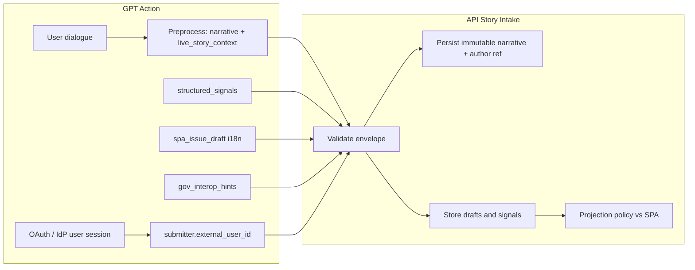

# 19. Inbound API: формат данных от GPT, препроцессинг и SPA/Gov-совместимый issue

## 1. Назначение документа

Этот файл — **единый контракт для разработки GPT Action / инструмента** и бэкенда Module 2. Он фиксирует:

1. **Ожидаемый inbound-формат** HTTP-запроса к API приёма историй (Story Intake), включая **идентификатор автора** из внешней OAuth (через GPT), без фиксации формата `user id`.
2. **Полный «живой» пакет истории** — всё, что GPT должен собрать при препроцессинге, чтобы не потерять смысл, контекст диалога и сигналы для downstream-слоёв.
3. **Встроенный SPA-совместимый блок** — структурированная, «сухая» проекция в формате дашборда (Distinct Issue / issue card), которую GPT готовит **как черновик**, а система валидирует и может переопределить по политике.
4. **Задел под гос-интеграции** — отдельный опциональный блок метаданных и идентификаторов без смешивания с narrative-truth.

Аудитория: разработчик GPT-интеграции, backend, архитектор контрактов. Документ согласован с `04-business-entities-model.md`, `09-spa-issue-projection.md`, `10-functional-requirements-system-spec.md`, `11-working-content-model.md`, solution architecture (`04-module-api-and-contract-layer`, `05-module-story-intake-and-store`, `07-module-distinct-issue-and-spa-projection`).

---

## 2. Принципы (обязательны к соблюдению в интеграции)

| Принцип | Смысл для GPT |
|--------|----------------|
| **Story-first** | Первичный актив — история пользователя; issue на витрине — производный объект. |
| **GPT не source-of-truth для управления** | Поля статуса публикации, финального `id` issue в проде, принятие в кластер/issue — определяет система и политики; GPT передаёт **черновики и сигналы**. |
| **Разделение «user said» / «system inferred»** | Дословный текст и явные цитаты — в `narrative` и `live_story_context`; интерпретации, теги, нормализация — в `structured_signals` и `spa_issue_draft`. |
| **SPA zero-change (MVP)** | Форма `spa_issue_draft` совместима с текущим потреблением `issueService` / борда: обязательные поля и i18n как в `09-spa-issue-projection.md`. |
| **Идемпотентность** | Повторная отправка с тем же ключом не создаёт дубликат story. |
| **PII minimization** | Не запрашивать и не раздувать персональные данные сверх необходимого; явно помечать риск PII. |
| **OAuth на стороне GPT, авторство на бэкенде** | Логин пользователя выполняется у стороннего IdP; в API передаётся **opaque `submitter.external_user_id`** для фиксации авторства в Story Store. Формат id **не** нормируется контрактом. |
| **Разделение сервисной и пользовательской идентичности** | `Authorization` — доверие к каналу GPT Action; `submitter` — кто автор истории. |

---

## 3. Транспорт: метод, URL, заголовки

Реальный path версионируется (`/v1/stories/intake` и т.д.) — здесь логический контракт.

| Элемент | Требование |
|---------|------------|
| Метод | `POST` |
| `Content-Type` | `application/json` |
| `Authorization` | **Сервисная** аутентификация вызова (Bearer API key, HMAC и т.д.) — EPIC-M2-09; не путать с OAuth пользователя: пользовательский `sub` передаётся в теле в `submitter.external_user_id`. |
| `Idempotency-Key` | **Рекомендуется обязательным для GPT**: стабильная строка на одну пользовательскую «сессию отправки» (например hash от `conversation_id` + `tool_call_id` + нормализованного `original_text`). |
| `X-Request-Id` | Опционально; если нет — API возвращает `trace_id` в ответе. |

---

## 4. Корневая структура JSON

Корневой объект — **`StoryIntakeEnvelope`**. Все поля ниже — в одном теле запроса.

```json
{
  "schema_version": "m2.story_intake_envelope.v1",
  "submitter": { },
  "narrative": { },
  "structured_signals": { },
  "live_story_context": { },
  "location": { },
  "time": { },
  "origin": { },
  "privacy": { },
  "client": { },
  "spa_issue_draft": { },
  "gov_interop_hints": { }
}
```

| Поле | Обязательность | Роль |
|------|------------------|------|
| `schema_version` | **Да** | Версия контракта для совместимости. |
| `submitter` | **Да** при продуктовом потоке с логином | Внешний пользователь и авторство (OAuth через GPT); см. §5. |
| `narrative` | **Да** | Неизменяемое первичное свидетельство. |
| `structured_signals` | Нет | Интерпретации/сигналы для Intelligence/Profile. |
| `live_story_context` | Нет, но **рекомендуется для GPT** | «Живая» история: ветки диалога, уточнения, сохранение параметров смысла. |
| `location` | Нет | Подсказка для Geo Intelligence. |
| `time` | Нет | Время события/сообщения. |
| `origin` | Рекомендуется | Связь с OpenAI (conversation, tool call). |
| `privacy` | Нет | Маркировка PII и пожеланий по редукции. |
| `client` | Нет | Версия GPT Action. |
| `spa_issue_draft` | Нет, но **рекомендуется для GPT** | Сухой SPA-совместимый черновик issue. |
| `gov_interop_hints` | Нет | Задел под гос-API без смешения с narrative. |

---

## 5. Блок `submitter` (внешний пользователь, OAuth, авторство)

Аутентификация конечного пользователя выполняется **на стороне GPT-интеграции** через стороннюю **OAuth/OpenID** систему (или эквивалент). Бэкенд Module 2 **не** является OAuth Authorization Server для этого потока: он получает уже установленный факт «пользователь прошёл вход у провайдера» и **идентификатор субъекта**, который нужно **сохранить для фиксации авторства** истории (и дальнейшей lineage/evidence).

### 5.1. Разделение уровней доверия

| Уровень | Где | Назначение |
|--------|-----|------------|
| **Сервисная аутентификация** | Заголовок `Authorization` (и др.) | Доверие к **вызову API** от имени GPT Action / backend-for-frontend (ключ, HMAC, mTLS — по политике EPIC-M2-09). |
| **Субъект (автор истории)** | Тело JSON: блок `submitter` | **Кто** является автором содержания story с точки зрения продукта; связывается с записью в хранилище и не подменяется narrative. |

Без доверия к сервисному каналу блок `submitter` нельзя принимать как истину; при этом при валидном сервисном вызове **`submitter.external_user_id` обязан дойти до персистентного слоя** (см. solution architecture `10-data-architecture-and-state-model.md`, EPIC-M2-02, EPIC-M2-09).

### 5.2. Поля блока `submitter`

| Поле | Тип | Обяз. | Описание |
|------|-----|-------|----------|
| `external_user_id` | `string` | **Да** (для продуктового потока с логином) | **Нормализованный идентификатор субъекта** от OAuth-провайдера или связки GPT↔IdP. **Формат намеренно не фиксируется**: opaque string (UUID, `sub` из JWT, хеш, составной ключ). Сервер хранит как есть, без семантического парсинга. |
| `identity_issuer` | `string` | Рекомендуется | Кто выдал идентичность: URL issuer OIDC, имя провайдера (`auth0`, `keycloak`, `custom-idp`), чтобы различать коллизии между провайдерами. |
| `identity_subject_hint` | `string` | Нет | Дублирование `sub`/аналога, если `external_user_id` составной; опционально. |
| `authenticated_at` | `string` | Нет | ISO 8601 UTC — когда у пользователя была подтверждена сессия у IdP (если доступно). |
| `display_name_hint` | `string` | Нет | Отображаемое имя **только если политика продукта разрешает**; по умолчанию лучше не передавать (PII minimization). |

### 5.3. Правила

- **Стабильность:** один и тот же пользователь должен стабильно получать **тот же** `external_user_id` при повторных сабмитах (на стороне OAuth/GPT).
- **Нет подделки с клиента:** бэкенд доверяет `submitter` только в связке с **проверенным** сервисным вызовом (и при необходимости подписью/токеном интеграции, определённым в EPIC-M2-09); при сомнении — отклонение или анонимный intake по политике.
- **Не смешивать с `origin`:** `origin` — про OpenAI (conversation, tool); `submitter` — про человека-автора.
- **Не дублировать в `narrative`:** идентификаторы не вставлять в `original_text`.

### 5.4. Персистенция на бэкенде (ожидание)

При сохранении story в Story Store поля авторства маппятся в логическую модель (например `story_origin` / `submitted_by_external_id` / связь с таблицей внешних субъектов) — детали схемы в миграциях; **ключевое требование:** идентификатор не теряется на пути intake → store → evidence.

---

## 6. Блок `narrative` (обязательный)

Хранится как **immutable core**; бэкенд не перезаписывает `original_text`.

| Поле | Тип | Обяз. | Описание |
|------|-----|-------|----------|
| `original_text` | `string` | **Да** | Полный дословный текст, как итог пользовательского ввода в чате (можно включать несколько сообщений, склеенных с маркерами — см. `live_story_context`). |
| `language` | `string` | Нет | BCP-47 (`et`, `ru`, `en`). |
| `title_hint` | `string` | Нет | Короткий заголовок от пользователя или кандидат заголовка; не равен финальному `title` issue. |
| `locale_preferences` | `object` | Нет | Например `{ "primary": "et", "fallback": ["en", "ru"] }` для последующей i18n. |

**Валидация:** `original_text` — непустая строка после trim; максимальная длина задаётся политикой API (рекомендация: документировать лимит в OpenAPI).

---

## 7. Блок `structured_signals` (опциональный)

Всё ниже — **интерпретация**, версионируемая отдельно от `original_text`. Подходит для Story Profile / кластерных фич позже.

| Поле | Тип | Описание |
|------|-----|----------|
| `normalized_text` | `string` | Переформулировка без потери смысла (не заменяет original). |
| `deep_need` | `string` | Глубинная потребность. |
| `desired_state` | `string` | Желаемое состояние системы/среды. |
| `emotional_meaning` | `string` | Эмоциональный слой (осторожно с PII). |
| `topic_hints` | `string[]` | Тематические подсказки. |
| `system_failure_type_hint` | `string` | Черновик типа сбоя; должен маппиться на **словарь** `type` на бэкенде. |
| `affected_object_hint` | `string` | Объект инфраструктуры/среды. |
| `public_relevance_hint` | `string` | Сигнал значимости. |
| `repeatability_hint` | `string` | Оценка повторяемости паттерна. |
| `institution_hints` | `string[]` | Предполагаемые ведомства/уровень (черновик). |

Пустой объект `{}` или отсутствие ключа — допустимо.

---

## 8. Блок `live_story_context` (рекомендуемый для GPT)

Цель — **сохранить «живые» параметры истории**, которые не сводятся к одному полю `original_text`: ход уточнений, противоречия, уровень уверенности, ссылки на медиа.

| Поле | Тип | Описание |
|------|-----|----------|
| `dialogue_turns` | `array` | Элементы: `{ "role": "user" \| "assistant", "content": "string", "timestamp": "ISO8601?" }` — если доступно. |
| `user_clarifications` | `array` | Уточняющие ответы пользователя в хронологии: `{ "question_prompt_ref": "string?", "answer": "string" }`. |
| `key_facts` | `array` | Извлечённые факты с опорой на текст: `{ "fact": "string", "evidence_quote": "string?", "confidence": "high|medium|low" }`. |
| `entities` | `array` | `{ "name": "string", "kind": "place|org|person|other", "mentions": number }` — для NER без подмены narrative. |
| `media_references` | `array` | `{ "kind": "image|video|link|file", "url_or_uri": "string", "caption": "string?", "hash": "string?" }` — без загрузки бинарников в JSON при необходимости вынести в отдельный upload flow. |
| `consistency_notes` | `string` | Противоречия в диалоге, оговорки («пользователь сначала сказал X, потом уточнил Y»). |
| `severity_user_perspective` | `string` | Как пользователь оценивает тяжесть (не путать с системной severity). |

Этот блок **не** отображается на публичном SPA-дашборде целиком; он нужен аналитике, explainability и evidence pipeline.

---

## 9. Блок `location` (подсказка для Geo)

На входе только hint; координаты и нормализованный адрес — результат `GeoService`.

| Поле | Тип | Описание |
|------|-----|----------|
| `free_text` | `string` | Как в чате. |
| `country_code` | `string` | ISO 3166-1 alpha-2. |
| `admin_hint` | `string` | Регион/район. |
| `coordinates_user_provided` | `object` | Опционально `{ "lat": number, "lon": number, "accuracy_m": number? }` если пользователь передал точку. |

---

## 10. Блок `time`

| Поле | Тип | Описание |
|------|-----|----------|
| `kind` | `string` | `exact_instant` \| `date` \| `date_range` \| `approximate` \| `unknown` |
| `iso_datetime` | `string` | ISO 8601. |
| `date` | `string` | `YYYY-MM-DD`. |
| `range` | `object` | `{ "start": "ISO8601 или date", "end": "..." }`. |
| `user_text` | `string` | Неформализованное описание («на прошлой неделе»). |

Словарь `kind` должен совпадать с серверной валидацией (избегать рассинхрона legacy-enum).

**Связь с SPA (`ISSUE_TIME_TYPE` в `spa-app/src/domain/types.js`):** поля `time` в intake — **подсказка до нормализации**; при проекции на карточку Issue сервер/слой проекции маппит на доменную модель SPA. Ориентировочное соответствие (не смешивать строки без явного маппинга в OpenAPI):

| `time.kind` (intake) | Целевой `ISSUE_TIME_TYPE` (логика) |
|----------------------|-----------------------------------|
| `exact_instant` | `exact` |
| `date` | `date` |
| `date_range` | `date_range` |
| `approximate` | `approx_period` (или внутренний аналог — по политике сервера) |
| `unknown` | не задавать / `null` на проекции |

Если в intake и в SPA используются **разные строковые литералы**, маппинг обязан быть **явным** в коде или в OpenAPI (избегать «тихого» совпадения имён).

---

## 11. Блок `origin` (связь GPT ↔ API)

| Поле | Тип | Описание |
|------|-----|----------|
| `source` | `string` | Например `openai_gpt_action`. |
| `conversation_id` | `string` | ID разговора OpenAI. |
| `tool_call_id` | `string` | ID вызова action. |
| `assistant_id` | `string` | Опционально. |
| `submitted_at` | `string` | ISO 8601 UTC от клиента. |
| `external_ref` | `string` | Доп. стабильный ключ для lineage. |

---

## 12. Блок `privacy`

| Поле | Тип | Описание |
|------|-----|----------|
| `contains_pii` | `boolean` | Есть ли вероятность PII в тексте. |
| `redaction_requested` | `boolean` | Пожелание ограничить витринный показ. |
| `data_tier` | `string` | Опционально: `public_safe` \| `internal` \| `restricted` — политика на стороне сервера. |

---

## 13. Блок `client`

| Поле | Тип | Описание |
|------|-----|----------|
| `name` | `string` | Имя интеграции. |
| `version` | `string` | Semver action. |

---

## 14. Блок `spa_issue_draft` — «сухой» issue для SPA и задел под гос-интеграции

### 13.1. Статус черновика

Это **не** финальный Distinct Issue в БД. Семантика:

- GPT готовит **максимально готовую** карточку для дашборда.
- API сохраняет её как **черновик проекции** / сигнал для операторского контура и **валидирует** enums, i18n, отсутствие фиктивных txid.
- Поля `status`, `id` (если переданы) могут быть **игнорированы или принудительно нормализованы** (например статус витрины `NEW` до review).

Рекомендуемый подполе:

| Поле | Тип | Описание |
|------|-----|----------|
| `draft_provenance` | `string` | Всегда `gpt_preprocess_v1` для трассировки. |
| `confidence` | `number` | 0..1 — уверенность GPT в качестве суммаризации (для приоритизации review). |

### 13.2. Обязательные поля SPA (MVP hard constraint)

Совместимость с `09-spa-issue-projection.md`:

| Поле | Тип | Правила |
|------|-----|---------|
| `id` | `string` | Для intake-черновика: **временный** клиентский id или пустой — сервер генерирует canonical `story_id` / `issue_candidate_id`; если передаётся, трактовать как correlation id, не как финальный production id без политики merge. |
| `status` | `string` | Для GPT: рекомендуется передавать `NEW` или оставить пустым — **сервер** выставляет по политике. |
| `type` | `string` | Только из **согласованного словаря** типов (тот же, что UI-фильтры). Несовпадение → ошибка валидации или маппинг `OTHER` с логом. |
| `labels` | `string[]` | Только из согласованного набора лейблов. |
| `title` | `i18n_text` | См. §13.3. |
| `summary` | `i18n_text` | Если пусто — fallback на `title` на стороне projection policy. |
| `description` | `i18n_text` | Полная контекстная формулировка для карточки/детальной страницы. |

Тип **`i18n_text`**:

```json
{
  "et": "string",
  "ru": "string",
  "en": "string"
}
```

Правила:

- Все три ключа **обязательны**; при отсутствии перевода — дублировать best-effort основной язык narrative в остальные с пометкой в логах (product policy).
- GPT выполняет **весь препроцессинг перевода/кратких формулировок** здесь, чтобы downstream не гадал.

### 13.3. Опциональные поля SPA

| Поле | Тип | Описание |
|------|-----|----------|
| `institution` | `i18n_text` \| `string` | По политике: либо i18n, либо строка — зафиксировать в OpenAPI. |
| `created_at` | `string` | ISO 8601; может быть перезаписана временем приёма на сервере. |
| `arweave_txid` | `string` | Только реальные; **фиктивные запрещены** (`09`). |
| `image_txid` | `string` | Аналогично. |
| `image_hash` | `string` | Опционально. |

### 13.4. Расширения для «сухой» сути (гос-интеграции позже)

Не ломая SPA, можно добавлять **параллельные** поля внутри `spa_issue_draft`:

| Поле | Тип | Описание |
|------|-----|----------|
| `executive_summary` | `i18n_text` | Ещё более сжатое резюме для пакетов вне UI. |
| `requested_outcome` | `i18n_text` | Желаемый исход от имени общественного интереса. |
| `jurisdiction_hints` | `object` | `{ "country": "EE", "municipality_code": "string?" }` — только если есть уверенность. |
| `regulatory_refs` | `array` | `{ "code": "string", "title": "string?" }` — опционально, для будущих интеграций. |

Сервер может игнорировать неизвестные ключи в зависимости от `schema_version`.

---

## 15. Блок `gov_interop_hints` (опционально, отдельно от SPA)

Чтобы не смешивать **дашборд** и **гос-форматы**, выносите сюда то, что не нужно SPA:

| Поле | Тип | Описание |
|------|-----|----------|
| `case_classification_code` | `string` | Внутренний или внешний код классификатора (когда появится справочник). |
| `submission_channel` | `string` | `gpt_web` \| `mobile` \| … |
| `preferred_response_language` | `string` | BCP-47. |
| `public_registry_ids` | `array` | Будущие связи с реестрами. |

---

## 16. Поток данных (диаграмма)



---

## 17. Поведение сервера (кратко, для согласованности ожиданий)

1. **Приём:** валидировать `schema_version`, `narrative.original_text`, размеры, enums в `spa_issue_draft` если блок присутствует.
2. **Авторство:** если по политике окружения требуется логин — отклонять запрос без валидного `submitter.external_user_id`; иначе разрешать анонимный/demo intake. Сохранённые `external_user_id` + `identity_issuer` **не** теряются: пишутся в Story Store / origin-слой и доступны для lineage (см. `10-data-architecture-and-state-model.md`).
3. **Иммутабельность:** записать `original_text` без изменений.
4. **Черновик SPA:** сохранить `spa_issue_draft` как версионируемую проекцию/кандидат; статусы публикации не определяются GPT.
5. **Идемпотентность:** дубликаты по `Idempotency-Key` возвращают тот же идентификатор story и не дублируют запись.
6. **Гео/время:** асинхронно или синхронно обогащать, не перезаписывая narrative.

---

## 18. Пример полного inbound-тела

```json
{
  "schema_version": "m2.story_intake_envelope.v1",
  "submitter": {
    "external_user_id": "opaque-subject-from-oauth-provider",
    "identity_issuer": "https://idp.example.com",
    "authenticated_at": "2026-04-19T13:55:00Z"
  },
  "narrative": {
    "original_text": "[User]: В Ласнамяэ уже вторую неделю не вывозят мусор у дома 12.\n[User]: Уточняю — контейнеры у подъезда А, переполнены.\n[Assistant]: Зафиксировала. Как давно это началось?\n[User]: С 1 апреля примерно.",
    "language": "ru",
    "title_hint": "Мусор не вывозят"
  },
  "structured_signals": {
    "normalized_text": "Жители Ласнамяэ сообщают о прекращении вывоза ТБО у дома … с начала апреля.",
    "deep_need": "Восстановление регулярного вывоза отходов",
    "desired_state": "Пустые контейнеры по графику",
    "topic_hints": ["waste", "municipal_services"],
    "system_failure_type_hint": "service_interruption",
    "affected_object_hint": "контейнерные площадки у жилого дома",
    "public_relevance_hint": "neighborhood",
    "repeatability_hint": "suspected_systemic_delay"
  },
  "live_story_context": {
    "dialogue_turns": [
      { "role": "user", "content": "В Ласнамяэ уже вторую неделю не вывозят мусор у дома 12." },
      { "role": "user", "content": "Уточняю — контейнеры у подъезда А, переполнены." }
    ],
    "key_facts": [
      { "fact": "Вывоз ТБО не осуществляется около двух недель", "evidence_quote": "уже вторую неделю не вывозят", "confidence": "high" },
      { "fact": "Локализация: Ласнамяэ, дом 12, подъезд А", "confidence": "high" }
    ],
    "consistency_notes": "Пользователь уточнил подъезд после первого сообщения."
  },
  "location": {
    "free_text": "Lasnamäe, Tallinn",
    "country_code": "EE"
  },
  "time": {
    "kind": "date_range",
    "range": { "start": "2026-04-01", "end": "2026-04-19" },
    "user_text": "с 1 апреля примерно"
  },
  "origin": {
    "source": "openai_gpt_action",
    "conversation_id": "conv_abc123",
    "tool_call_id": "call_xyz789",
    "submitted_at": "2026-04-19T14:00:00Z"
  },
  "privacy": {
    "contains_pii": false,
    "redaction_requested": false
  },
  "client": {
    "name": "doge-module2-gpt",
    "version": "0.2.0"
  },
  "spa_issue_draft": {
    "draft_provenance": "gpt_preprocess_v1",
    "confidence": 0.82,
    "id": "client-correlation-001",
    "status": "NEW",
    "type": "complaint",
    "labels": ["waste", "district"],
    "title": {
      "et": "Prügivedu on Lasnamäel katkenud",
      "ru": "В Ласнамяэ не вывозят мусор",
      "en": "Waste collection interrupted in Lasnamäe"
    },
    "summary": {
      "et": "Elanikud teatavad jäätmete kogumise katkestamisest …",
      "ru": "Жители сообщают о прекращении вывоза ТБО у дома …",
      "en": "Residents report waste collection has stopped near …"
    },
    "description": {
      "et": "… pikem kontekst …",
      "ru": "… полное описание для карточки …",
      "en": "… full context for dashboard …"
    },
    "institution": {
      "et": "Kohalik omavalitsus",
      "ru": "Местные власти",
      "en": "Municipal authority"
    },
    "executive_summary": {
      "et": "…",
      "ru": "…",
      "en": "…"
    }
  },
  "gov_interop_hints": {
    "submission_channel": "gpt_web",
    "preferred_response_language": "et"
  }
}
```

---

## 19. Минимальный валидный запрос (без SPA и без live context)

Если политика требует авторство — добавьте `submitter` как в §5; для демо/анонимного режима блок может быть опущен **только** если это явно разрешено конфигурацией API.

```json
{
  "schema_version": "m2.story_intake_envelope.v1",
  "submitter": {
    "external_user_id": "opaque-id-from-your-oauth-flow",
    "identity_issuer": "your-idp-or-gpt-linkage-name"
  },
  "narrative": {
    "original_text": "Текст истории пользователя.",
    "language": "et"
  }
}
```

---

## 20. Ошибки валидации (ожидаемые коды для GPT)

Рекомендуемая таксономия на стороне API (точные имена — в OpenAPI):

| Условие | HTTP | Поведение |
|---------|------|-----------|
| Нет `schema_version` / неподдерживаемая версия | 400 | Сообщить поддерживаемые версии. |
| Пустой `original_text` | 400 | Явное поле ошибки. |
| Невалидный `spa_issue_draft.type` или `labels` | 400 или 422 | Список допустимых значений. |
| Неполный i18n в title/summary/description | 400 | Указать отсутствующие ключи. |
| Фиктивный `arweave_txid` / `image_txid` | 400 | По политике `09`. |
| Конфликт идемпотентности | 409 | Редко; обычно возврат того же ресурса. |
| Политика требует `submitter`, но блок отсутствует / пустой `external_user_id` | 401 или 400 | Явный код (например `AUTHORSHIP_REQUIRED`); не путать с ошибкой сервисного `Authorization`. |

---

## 21. Версионирование контракта

- **`m2.story_intake_envelope.v1`** — текущая версия документа.
- Изменения несовместимые с клиентом → новая minor/major строка `schema_version` и параллельная поддержка на сервере в переходный период.

---

## 22. Трассируемость к артефактам

| Тема | Файл |
|------|------|
| SPA поля | `09-spa-issue-projection.md` |
| Distinct issue логика | `08-distinct-issue-product-logic.md` |
| Content model | `11-working-content-model.md` |
| FR группы | `10-functional-requirements-system-spec.md` |
| API модуль | solution architecture `04-module-api-and-contract-layer.md` |
| Intake/store | `05-module-story-intake-and-store.md` |
| Авторство / внешний user id | этот файл §5; EPIC-M2-02; EPIC-M2-09; `10-data-architecture-and-state-model.md` |

---

## 23. Чеклист для разработчика GPT Action

- [ ] После успешного OAuth у стороннего IdP передавать `submitter.external_user_id` (opaque) и по возможности `identity_issuer`; не класть id в `narrative.original_text`.
- [ ] Всегда отправлять `narrative.original_text` дословно (согласованно с UX сбора текста).
- [ ] Заполнять `live_story_context`, если диалог многошаговый.
- [ ] Заполнять `spa_issue_draft` с полным `i18n` для title/summary/description.
- [ ] Не подставлять фиктивные blockchain-идентификаторы.
- [ ] Передавать `Idempotency-Key` и `origin.tool_call_id`.
- [ ] Не полагаться на то, что `status`/`id` в черновике станут финальными без сервера.
- [ ] Помечать PII в `privacy.contains_pii`.
