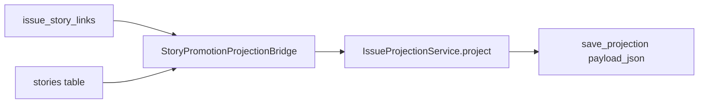

# Reproject issue i18n backfill (RU)

## 1. Назначение

One-off ops-утилита **GW-L10N-01 (T03)**: пересобирает `doge_issues.payload_json` для уже существующих issue, подставляя **реальный per-locale контент** из linked stories (dominant story), вместо старых «одинаковых копий» во всех локалях.

Скрипт: [`scripts/reproject_issue_i18n.py`](../../../scripts/reproject_issue_i18n.py)

## 2. Зачем нужен

- Новый код извлечения i18n ([`extraction_policy.py`](../../../src/core/projection/extraction_policy.py) L141–152) применяется к **новым** проекциям при cluster/manual create.
- Старые записи в БД остаются с flat i18n (`title.et == title.en`) до явного backfill.
- Запускать **после деплоя** GW-L10N-01 T01/T02 (extraction policy + manual POST i18n).

## 3. Что делает (data flow)



Источники:

- [`scripts/reproject_issue_i18n.py`](../../../scripts/reproject_issue_i18n.py) — `run_reproject()`
- [`issue_create.py`](../../../src/core/application/issue_create.py) — `StoryPromotionProjectionBridge.build_projection_input`

## 4. Предусловия

| Требование | Деталь |
|------------|--------|
| Backend | `DB_BACKEND=sqlite` или `supabase` — **не** `in_memory` (скрипт завершится с ошибкой) |
| Env | См. [`server-env-quickstart.md`](../server-env-quickstart.md): `DATABASE_URL` или `SUPABASE_URL` + `SUPABASE_SERVICE_ROLE` |
| Загрузка `.env` | Как у сервера: `make serve` / экспорт переменных в shell перед запуском скрипта |
| Данные | Строки в `issue_story_links` + существующие проекции в `doge_issues` |

Wiring: `provide_service_factory()` → [`DefaultServiceFactory`](../../../src/core/infrastructure/service_factory.py) (см. `_resolve_wiring` в скрипте).

## 5. Как запускать

```bash
cd doge-complaints-gateway

# 1) всегда сначала dry-run
python3 scripts/reproject_issue_i18n.py --dry-run

# 2) запись в БД
python3 scripts/reproject_issue_i18n.py

# 3) точечно по issue (флаг повторяемый)
python3 scripts/reproject_issue_i18n.py --dry-run --issue-id <uuid>
python3 scripts/reproject_issue_i18n.py --issue-id <uuid>
```

## 6. Интерпретация вывода

- `done (dry-run): updated=N skipped=M` — N issue готовы к обновлению; M пропущены (нет проекции, нет stories, или `ValueError` в bridge).
- `skip: no issue_story_links for <id>` (stderr) — `--issue-id` без связей в `issue_story_links`.
- Повторный прогон **идемпотентен** — подтверждено [`tests/test_reproject_issue_i18n.py`](../../../tests/test_reproject_issue_i18n.py).

## 7. Что сохраняется при записи

- `type` из существующего payload (скрипт L153–154).
- `status` — из payload или row, fallback `PUBLISHED` (`_issue_status`).

## 8. Out of scope

- Не добавляет `original_locale` (scope **GW-L10N-02**).
- Не cron и не автоматический re-project при каждом story update.
- Не миграция DDL (`payload_json` остаётся JSON blob).

## 9. Связанные артефакты

- Story: STORY-GW-L10N-01 T03 (скрипт), T07 (автотесты)
- Тесты: `tests/test_reproject_issue_i18n.py`
- Аудит: `docs/analysis/audit-gw-l10n-01-projection-content-i18n-2026-06-15.md`
