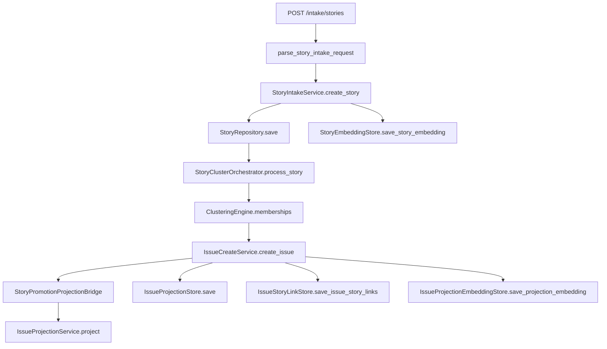

# Architecture & Layers (as-is)

## Контекст и управленческий вопрос

Текущий вопрос для архитектурного управления:  
**можно ли считать runtime-контур модульно устойчивым, с понятной ответственностью слоев и контролем дрейфа зависимостей?**

## Current state (implemented now)

### 1) Layer map

1. **API transport layer**
   - `src/core/api/asgi_app.py` (FastAPI маршруты)
   - `src/core/api/handlers.py` (HTTP handler orchestration)
   - `src/core/api/envelope.py`, `security.py`, `metrics.py`, `logging.py`
2. **Application layer**
   - `src/core/application/services.py` (`StoryIntakeService`)
   - `src/core/application/story_cluster_orchestrator.py`
   - `src/core/application/issue_create.py` (issue materialization + projection bridge)
3. **Domain contracts**
   - `src/core/domain/contracts.py`
   - `src/core/promotion/types.py`, `src/core/projection/input.py`
4. **Infrastructure layer**
   - `src/core/infrastructure/providers.py`
   - `src/core/infrastructure/service_factory.py`
   - `src/core/infrastructure/repositories.py` (in-memory)
   - `src/core/infrastructure/db_sqlite.py`, `db_supabase.py`
5. **Config layer**
   - `src/core/config/schema.py`

### 2) Composition and dependency assembly

Runtime graph строится через:

- `build_api_dependencies()` -> API-level dependency object
- `provide_service_factory()` -> backend-aware stores/services
- `DefaultServiceFactory` -> `StoryIntakeService`, `StoryClusterOrchestrator`, `IssueCreateService`, projection policy, DB probes

### 3) Active HTTP runtime surface

| Method | Route | Access | Runtime meaning |
|---|---|---|---|
| GET | `/health` | public | liveness |
| GET | `/ready` | public | readiness + `db.backend/ready/checks` |
| GET | `/protected/status` | protected | auth gate check |
| GET | `/metrics` | protected | in-process metrics |
| GET | `/demo/auth-page` | public | demo static HTML |
| GET | `/demo/auth-page/` | public | demo static HTML alias |
| GET | `/demo/auth-page/styles.css` | public | demo static CSS |
| POST | `/intake/stories` | public | story-first intake trigger |

`POST /issues` отсутствует: issue materialization только через story-first orchestration.

### 4) Runtime flow (story-first)

### 5) Contracts and data shapes

- Intake contract: `StoryIntakeRequest` (`m2.story_intake_envelope.v1`) в `src/core/intake/contracts.py`
- Issue projection output: `SpaIssueProjection` в `src/core/projection/dto.py`
- Projection derivation policy boundary: `StoryToProjectionPolicy` в `src/core/projection/extraction_policy.py`
- Embedding policy versioning:
  - story: `STORY_EMBEDDING_POLICY_VERSION`
  - issue: `ISSUE_EMBEDDING_POLICY_VERSION`

### 6) Config knobs actually used

- `DB_BACKEND`: `in_memory | sqlite | supabase`
- `DATABASE_URL`, `SUPABASE_URL`, `SUPABASE_SERVICE_ROLE` (в supabase/sqlite режимах)
- `SERVICE_API_TOKEN` (protected endpoints)
- `APP_PROFILE`, `API_BASE_URL`, `REQUEST_TIMEOUT_S`, feature flags adapter-профиля

### 7) Verification evidence

- Layer/DI: `tests/test_layer_guardrails.py`, `tests/test_bootstrap_smoke.py`, `tests/test_di_service_factory.py`
- HTTP transport: `tests/test_http_transport_smoke.py`, `tests/test_http_intake_endpoint.py`, `tests/test_http_issue_create_endpoint.py`
- Story-first e2e: `tests/test_e2e_story_cluster_issue_pipeline.py`, `tests/test_e2e_intake_create_spa_contract.py`

## Planned target

- Выделение projection policy и story-first orchestration в отдельный модуль/микросервисный boundary.
- Усиление production profile: DB pooling/retries, richer readiness diagnostics, stricter operational auth policy.

## Gaps / risks

- Пока нет выделенного asynchronous job boundary для тяжелых clustering/projection операций.
- Supabase runtime зависит от внешнего migration процесса (не встроен в приложение).
- Demo static + API живут в одном процессе; для production лучше разнести delivery surfaces.
