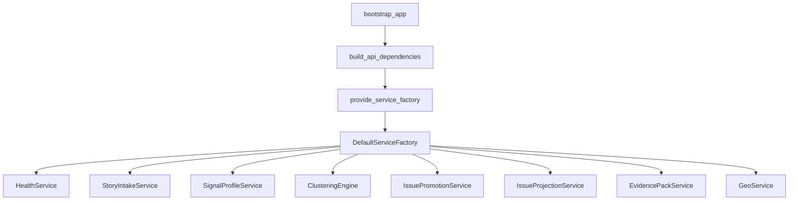
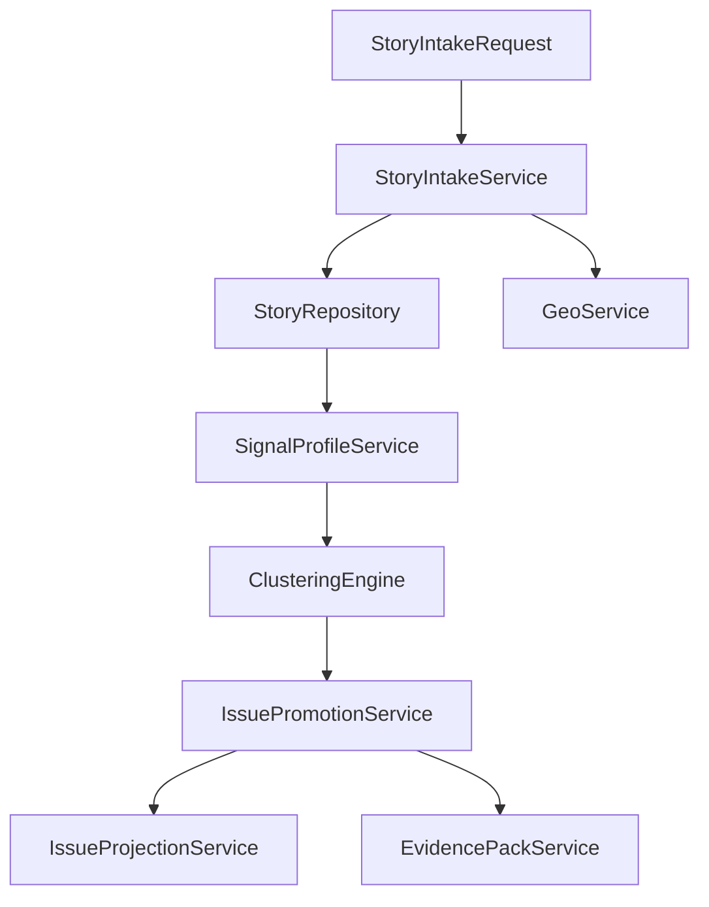

# Architecture & Layers (as-is)

## Контекст и управленческий вопрос

Текущий вопрос для архитектурного управления:  
**можно ли считать runtime-контур модульно устойчивым, с понятной ответственностью слоев и контролем дрейфа зависимостей?**

## Current state (implemented now)

### 1) Composition root и цепочка сборки

Фактическая сборка runtime выполняется в несколько этапов:

1. `bootstrap_app()` в `src/core/bootstrap.py` поднимает верхний runtime container.
2. `build_api_dependencies()` в `src/core/api/dependencies.py` собирает API boundary dependencies.
3. `provide_service_factory()` в `src/core/infrastructure/providers.py` формирует инфраструктурный wiring.
4. `DefaultServiceFactory` в `src/core/infrastructure/service_factory.py` отдает готовые application services.

### 2) Responsibility map по слоям

1. **Bootstrap / composition**
   - Функция: стартовая сборка runtime dependency graph.
   - Файлы: `src/core/bootstrap.py`.
2. **API boundary**
   - Функция: envelope, trace, security gate, ops-level handlers.
   - Файлы: `src/core/api/dependencies.py`, `src/core/api/handlers.py`, `src/core/api/envelope.py`, `src/core/api/security.py`, `src/core/api/metrics.py`, `src/core/api/logging.py`.
3. **Application**
   - Функция: orchestration бизнес-переходов и use-case поведения.
   - Файлы: `src/core/application/factory.py`, `src/core/application/services.py`.
4. **Domain**
   - Функция: неизменяемые контракты и статусы сущностей (`StoryRecord`, `SignalProfileRecord`, lifecycle enums).
   - Файлы: `src/core/domain/contracts.py`.
5. **Infrastructure**
   - Функция: concrete repositories/providers/service wiring для текущего runtime.
   - Файлы: `src/core/infrastructure/providers.py`, `src/core/infrastructure/service_factory.py`, `src/core/infrastructure/repositories.py`.

### 3) Feature-модули и их роль в цепочке данных

- `intake`: контракт входного payload и построение response envelope (`src/core/intake/contracts.py`).
- `profile`: нормализация/обогащение/валидация сигналов (`src/core/profile/*`).
- `cluster`: построение кластерных view и readiness score (`src/core/cluster/engine.py`).
- `promotion`: gate-based переходы кандидатов и audit trail (`src/core/promotion/*`).
- `projection`: governed mapping в SPA issue контракт (`src/core/projection/*`).
- `evidence`: lineage/evidence pack и tiered redaction (`src/core/evidence/*`).
- `geo`: cache-first гео-резолвинг с fallback/retry (`src/core/geo/*`).
- `adapters`: wallet/sign/broadcast protocol surfaces и demo/pilot stubs (`src/core/adapters/*`).
- `config`: профиль и feature-flag contract (`src/core/config/schema.py`).

### 4) Фактический data-flow контур (domain pipeline)

Примечание: этот pipeline отражает модульную совместимость и service surfaces.  
Полный orchestration сценарий как единый runtime workflow в коде сейчас не собран в один end-to-end orchestrator.

### 5) Как контролируется архитектурный дрейф

- `tests/test_layer_guardrails.py` фиксирует import-ограничения между слоями.
- `tests/test_bootstrap_smoke.py` подтверждает, что composition дает рабочий runtime.
- `tests/test_di_service_factory.py` подтверждает, что `DefaultServiceFactory` выдает ожидаемые services и конфиг.

## Architectural consequences and limitations

- Модель modular-by-contract уже есть, но delivery surface пока в форме handler functions, а не router/server entrypoint.
- Это снижает риск избыточной связанности на раннем этапе, но ограничивает прямую переносимость в production HTTP runtime без отдельного adapter слоя.
- DI дисциплина в коде подтверждается тестами, что хорошо для контролируемой эволюции.

## Planned target

- Добавить явный transport adapter (HTTP router/app), который оборачивает текущие handlers/services без изменения доменных контрактов.
- Расширить composition root под SQL-backed repositories и real chain adapters.
- Ввести end-to-end orchestration слой для сквозного сценария intake->promotion->projection->evidence.

## Gaps / risks

- Нет прямого `FastAPI/Flask` entrypoint в `src/core`; это важно для ожиданий ops-команд.
- Риск смешения target-архитектуры из `docs/solution architecture` с текущим runtime-as-is, если не держать строгую границу источников.
- Отсутствие e2e transport-level тестов увеличивает неопределенность при первом HTTP-обертывании.

## Контрольные проверки

- Проверка слоев и wiring:  
  `python3 -m pytest tests/test_layer_guardrails.py tests/test_bootstrap_smoke.py tests/test_di_service_factory.py -q`
