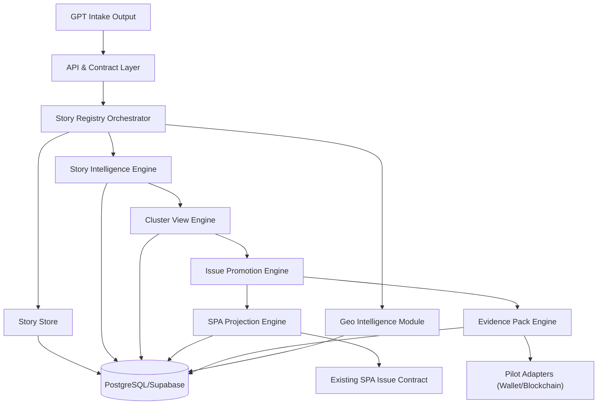

# 03. Целевая архитектура (Demo baseline)

## High-level схема

## Layering model
- **Presentation/API:** request validation, auth, DTO mapping.
- **Application/Orchestration:** lifecycle-команды и координаторы.
- **Domain:** story/profile/cluster/issue/evidence правила.
- **Infrastructure:** db, external APIs, adapters.

## Design principles
- Story-first, issue-later.
- Dynamic clustering, not static taxonomy.
- Projection as dedicated module (не side-effect кластера).
- Evidence-first traceability by default.
- Adapter-first tokenization readiness.
