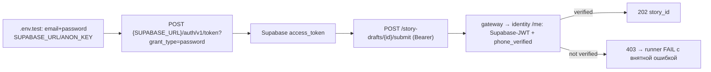

# STORY-GW-SEED-04 — Runner auth bootstrap (email+password → Supabase token)

## Meta
- **Key:** `STORY-GW-SEED-04-runner-auth-bootstrap-email-password`
- **Пакет:** [`demo-data-seeding/`](./INDEX.md)
- **Status:** 🔵 Done (Awaiting Commits)
- **Приоритет:** 🟠 MED — ops-удобство сидера; текущий submit требует руками вставленный `GATEWAY_USER_TOKEN`
- **Тип:** refactor / ops (runner auth + env + docs + tests)
- **Основание:** запрос оператора 2026-07-11 — «в `.env.test` задаётся логин/пароль пользователя, авторизация автоматизирована»; интервью-решения ниже
- **Зависит от:** [GW-SEED-03](./STORY-GW-SEED-03-end-to-end-seed-runbook.md) (runner stash+submit), [GW-DRAFT-06](../story-draft-handoff/STORY-GW-DRAFT-06-remove-legacy-intake-stories-route.md) (двухфазный runner)
- **Разблокирует:** hosted re-seed по [`seed-demo-data-runbook-ru.md`](../../../runtime-docs/manuals/seed-demo-data-runbook-ru.md) без ручного получения токена

## Зачем простыми словами
Сейчас, чтобы сидер сабмитил истории, нужно **руками** добыть verified user-токен и вставить его в `GATEWAY_USER_TOKEN`. Токен живёт недолго и его неудобно получать. Оператор хочет: в `.env.test` положить **email + пароль** своего (уже верифицированного) демо-аккаунта, а runner пусть **сам** обменивает их на токен на старте.

## Ключевой факт (verified по коду) — почему это просто
Submit-путь gateway форвардит user-Bearer в identity `GET /me` ([`me_client.py:31`](../../../../src/core/identity/me_client.py#L31)), а identity принимает **Supabase-JWT напрямую**: `CompositeBearerTokenAuth.validate` пробует **сначала Supabase-JWT** ([`security.py:53`](../../../../../doge-identity-service/src/core/api/security.py#L53)), только потом свой OAuth-JWT. Значит нужный `GATEWAY_USER_TOKEN` = **Supabase access_token**, который отдаёт `POST {SUPABASE_URL}/auth/v1/token?grant_type=password` (то же, что делает SPA через `supabase.auth.signInWithPassword` — [`LoginPage.jsx:188`](../../../../../spa-app/src/pages/LoginPage.jsx#L188)). **OAuth-хоровод (authorize→complete→token) сидеру не нужен.**

## Что наблюдаю сейчас (verified по коду)

| Элемент | As-is |
|---------|-------|
| Runner env | [`simulation_runner.py:39-40`](../../../../tests/simulation_runner.py#L39) грузит `.env.test` затем `.env` (формат `KEY=value`) |
| User-токен | [`simulation_runner.py:21,149`](../../../../tests/simulation_runner.py#L149) `resolve_user_bearer_token()` (из [`story_draft_intake_helpers.py`](../../../../tests/story_draft_intake_helpers.py)) читает `GATEWAY_USER_TOKEN` / alias `SMOKE_USER_BEARER_TOKEN` |
| Submit-гейт | `require_story_draft_submit_user` → `/me` → `phone_verified` (403 если нет) |
| `.env.test.example` | сейчас `GATEWAY_USER_TOKEN=your-user-oauth-token-here` (+ alias) |
| Runbook / manual | [`seed-demo-data-runbook-ru.md:58`](../../../runtime-docs/manuals/seed-demo-data-runbook-ru.md), [`simulation-runner-manual.md:51`](../../../runtime-docs/testing/simulation-runner-manual.md) описывают `GATEWAY_USER_TOKEN` |

## Решения интервью (2026-07-11)
- **D-SEED04-1 (provisioning):** **без авто-провижна**. Оператор подаёт **свой уже phone-verified аккаунт** через env. Если аккаунт не верифицирован — submit вернёт 403, runner **падает с внятной ошибкой** (fail-closed), не пытается чинить. Никаких DB-флагов/mock-SMS.
- **D-SEED04-2 (пакет):** `demo-data-seeding` → эта стори (GW-SEED-04).
- **D-SEED04-3 (fallback):** `GATEWAY_USER_TOKEN` **убрать полностью** — единственный путь email+password.

## Требование / целевое состояние

### A. Переменные окружения `.env.test` (оператор задаёт ДО работы над стори)

| Переменная | Кто задаёт | Что это |
|------------|-----------|---------|
| **`GATEWAY_USER_EMAIL`** | **оператор** (свой аккаунт) | email демо-пользователя (Supabase Auth), уже `phone_verified` |
| **`GATEWAY_USER_PASSWORD`** | **оператор** | пароль этого пользователя |
| **`SUPABASE_URL`** | инфра (из SPA-конфига `VITE_SUPABASE_URL`) | URL Supabase-проекта identity/SPA |
| **`SUPABASE_ANON_KEY`** | инфра (из SPA-конфига `VITE_SUPABASE_ANON_KEY`) | публичный anon-ключ (заголовок `apikey`) |
| ~~`GATEWAY_USER_TOKEN`~~ / ~~`SMOKE_USER_BEARER_TOKEN`~~ | — | **удаляются** (D-SEED04-3) |

> `GATEWAY_API_TOKEN`, `GATEWAY_URL`, `SIMULATION_CANVAS_PATH` — без изменений (stash-путь).

### B. Runner
- `resolve_user_bearer_token()` переписать: `email+password` (+ `SUPABASE_URL`/`SUPABASE_ANON_KEY`) → `POST {SUPABASE_URL}/auth/v1/token?grant_type=password` (header `apikey`, body `{email,password}`) → взять `access_token`. Токен — **только in-memory** (не писать на диск), берётся один раз на старте прогона.
- Fail-closed сообщения:
  - Supabase-логин не прошёл (неверные creds / нет env) → `RuntimeError` с указанием какой переменной не хватает или что логин отклонён.
  - submit `403` (`VERIFICATION_REQUIRED`) → внятная ошибка: «демо-пользователь не phone_verified — верифицируй телефон один раз в SPA, затем повтори».
  - submit `401` → «Supabase-токен невалиден/просрочен».
- Убрать чтение `GATEWAY_USER_TOKEN` / `SMOKE_USER_BEARER_TOKEN`.

### C. Docs
- [`.env.test.example`](../../../../.env.test.example): заменить блок `GATEWAY_USER_TOKEN` на 4 переменные из таблицы A.
- [`seed-demo-data-runbook-ru.md`](../../../runtime-docs/manuals/seed-demo-data-runbook-ru.md) §Шаг1 + предусловия: email+password вместо токена; отметить требование «аккаунт уже phone_verified».
- [`simulation-runner-manual.md`](../../../runtime-docs/testing/simulation-runner-manual.md) (SSOT загрузчика): таблица env, коды отказа, «где взять» → «свой verified аккаунт».

## Подзадачи

| ID | Задача |
|----|--------|
| **T01** | Runner auth: `resolve_user_bearer_token()` → Supabase password-grant (in-memory token); удалить `GATEWAY_USER_TOKEN`/alias |
| **T02** | Fail-closed сообщения (нет env / bad creds / 403 not-verified / 401) — не silent, не авто-провижн |
| **T03** | `.env.test.example` — 4 новые переменные, убрать старые |
| **T04** | Runbook + simulation-runner-manual (SSOT) — email+password путь, требование phone_verified, коды отказа |
| **T05** | Тесты: unit на `resolve_user_bearer_token` (мок Supabase token endpoint: успех / bad creds / отсутствие env); мигрировать существующие ссылки на `GATEWAY_USER_TOKEN` в тестах |
| **T06** | Acceptance gate: `grep GATEWAY_USER_TOKEN|SMOKE_USER_BEARER_TOKEN` = 0 в `src/`+`tests/`+`docs` (кроме истории/аудитов); full offline suite green; ручной smoke по runbook оператором |

## Acceptance Criteria
- [ ] `.env.test` использует `GATEWAY_USER_EMAIL`+`GATEWAY_USER_PASSWORD`+`SUPABASE_URL`+`SUPABASE_ANON_KEY`; `GATEWAY_USER_TOKEN`/`SMOKE_USER_BEARER_TOKEN` удалены (grep=0 в active code+docs)
- [ ] Runner на старте меняет email+password на Supabase access_token и сабмитит без ручного токена
- [ ] Не верифицирован / плохие creds / нет env → **явная ошибка** (fail-closed), не silent, без авто-провижна
- [ ] Токен только in-memory (не пишется на диск/в лог)
- [ ] Runbook + simulation-runner-manual + `.env.test.example` согласованы
- [ ] Full offline suite (`-m "not live_integration"`) green

## Открытые вопросы
- Нет (решены в интервью 2026-07-11: provisioning=ручной аккаунт оператора / пакет=demo-data-seeding / fallback=убрать).

## Границы
- **Вне scope:** авто-провижн verified-юзера, mock-SMS, правки identity OAuth. Демо-аккаунт готовит оператор один раз (phone_verified) сам.
- **Не трогать** серверные `SUPABASE_URL`/`SUPABASE_SERVICE_ROLE` gateway'а (это DB-бэкенд сервера, отдельно от auth демо-юзера в `.env.test`).
- Prod-код gateway API (роуты/handlers) не меняется — только runner (`tests/`), env-пример, docs.

## Швы
- Runner: [`tests/simulation_runner.py`](../../../../tests/simulation_runner.py), [`tests/story_draft_intake_helpers.py`](../../../../tests/story_draft_intake_helpers.py) (`resolve_user_bearer_token`)
- Env: [`.env.test.example`](../../../../.env.test.example)
- Auth-факт: [`identity security.py:53`](../../../../../doge-identity-service/src/core/api/security.py#L53) (Supabase-JWT принимается `/me`), [`me_client.py`](../../../../src/core/identity/me_client.py)
- Docs: [`seed-demo-data-runbook-ru.md`](../../../runtime-docs/manuals/seed-demo-data-runbook-ru.md), [`simulation-runner-manual.md`](../../../runtime-docs/testing/simulation-runner-manual.md)
