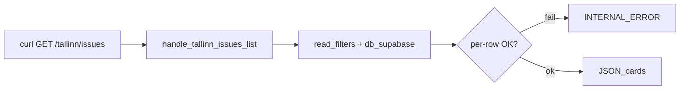

# STORY-GW-RC-07 — Hosted `/tallinn/issues` INTERNAL_ERROR regression

## Meta
- **Key:** `STORY-GW-RC-07`
- **Status:** 🔵 Done (Awaiting Commits) — pkg-000047 gate PASS 2026-07-10; `test_gw_rc_07_read_path_import_smoke.py` (commit `09e5b8f`). Header-sync [audit-mvp-scope-hard-2026-07-21](../../../analysis/audit-mvp-scope-hard-2026-07-21.md) §3.
- **Приоритет:** P1 Blocker (demo board broken on prod)
- **Тип:** fix / ops
- **Закрывает:** CF-B из [`audit-gw-seed-02-dataset-expansion-for-clustering-2026-06-22.md`](../../../analysis/audit-gw-seed-02-dataset-expansion-for-clustering-2026-06-22.md) §3
- **Основание:** audit CF-B; prior baseline [`tallinn-issues-live-response.json`](../../epics/EPIC-M2-06-spa-projection-and-i18n/stories/STORY-GW-RC-06-hosted-status-data-hygiene/task-gw-rc-06-t04-verify-tallinn-issues-and-board-cards/tallinn-issues-live-response.json) (1 card, 2026-06-20)
- **Зависит от:** RC-01→06 (read-path baseline); blocks [SEED-03](../demo-data-seeding/STORY-GW-SEED-03-end-to-end-seed-runbook.md) hosted T03

## Зачем простыми словами
На hosted в БД уже **8** issue-карточек (cron сработал), но публичный `GET /tallinn/issues` отдаёт `INTERNAL_ERROR` — доска пустая/битая. Нужно найти причину (deploy drift, битая строка, read-path crash) и восстановить отдачу карточек.

## Что наблюдаю сейчас (verified, audit 2026-06-22)

- Live `GET https://dogestonia-tallinn.up.railway.app/tallinn/issues` → `{"error":{"code":"INTERNAL_ERROR",...}}` (HTTP 200, error body); trace_id `d7581fb1-…` ([`audit-gw-seed-02`](../../../analysis/audit-gw-seed-02-dataset-expansion-for-clustering-2026-06-22.md) §CF-B).
- `/ready` green; hosted `doge_issues` = **8** PUBLISHED rows (7 new `INCIDENT` + legacy `test-7ef193be`).
- Local unit/sqlite read-path green; `INCIDENT` — valid `DOGEIssueType` ([`enums.py:19`](../../../../src/core/projection/enums.py)).
- Read handler entry: [`handlers.py`](../../../../src/core/api/handlers.py) `handle_tallinn_issues_list` → [`read_filters.py`](../../../../src/core/projection/read_filters.py) / [`db_supabase.py`](../../../../src/core/infrastructure/db_supabase.py).
- Route: [`asgi_app.py:429`](../../../../src/core/api/asgi_app.py) `GET /tallinn/issues` (публичный, без auth deps).
- **⚠️ Live re-verify:** статус prod на дату audit; перед fix — повторить curl + trace_id (не выдумывать текущее состояние).

## Требование / целевое состояние

- Воспроизвести и зафиксировать ошибку (curl + logs по trace_id).
- Сверить версию gateway на Railway с локальной (RC-04→06 на проде).
- Изолировать проблемную строку/поле (per-row read probe).
- Исправить root cause (`src/core/` и/или data repair).
- Hosted verify: `GET /tallinn/issues` → валидный JSON с issue-карточками (≥1).

## Граница

- In scope: hosted read/serving path for board API.
- Out of scope: новый seed canvas (SEED-02); полный E2E runbook (SEED-03) до фикса CF-B.

## Подзадачи

| ID | Задача |
|----|--------|
| **T01** | Reproduce: `curl -sS` hosted `/tallinn/issues`; сохранить body + `trace_id` в `hosted-internal-error-evidence.md` |
| **T02** | Deploy parity: Railway image/commit vs local HEAD; сверить columnar migrations RC-04 на hosted Supabase |
| **T03** | Per-row probe: для каждой из 8 `PUBLISHED` rows — isolated read через [`read_filters.py`](../../../../src/core/projection/read_filters.py) / direct SQL + projection merge ([`db_supabase.py`](../../../../src/core/infrastructure/db_supabase.py)) |
| **T04** | Fix root cause в `src/core/` и/или data repair script; regression test |
| **T05** | Story acceptance gate + hosted verify: `GET /tallinn/issues` ≥1 card |

## Acceptance Criteria

- [ ] `hosted-internal-error-evidence.md`: воспроизведение CF-B задокументировано.
- [ ] Root cause изолирован (T03) и исправлен (T04).
- [ ] Hosted `GET /tallinn/issues` отдаёт валидные карточки (не `INTERNAL_ERROR`).
- [ ] SEED-03 разблокирован для board-fill verify.

## Открытые вопросы

- Deploy на Railway отстаёт от локального HEAD?
- Какая из 8 строк ломает read-path (поле/type/status/i18n)?

## Швы

- Route: [`asgi_app.py:429`](../../../../src/core/api/asgi_app.py)
- Handler: [`handlers.py`](../../../../src/core/api/handlers.py) `handle_tallinn_issues_list`
- Read path: [`read_filters.py`](../../../../src/core/projection/read_filters.py), [`db_supabase.py`](../../../../src/core/infrastructure/db_supabase.py)
- Draft pkg: [`pkg-000038`](../../gateway-active-packages/pkg-000038-20260622-gw-rc-07-hosted-tallinn-issues-internal-error.yaml)
