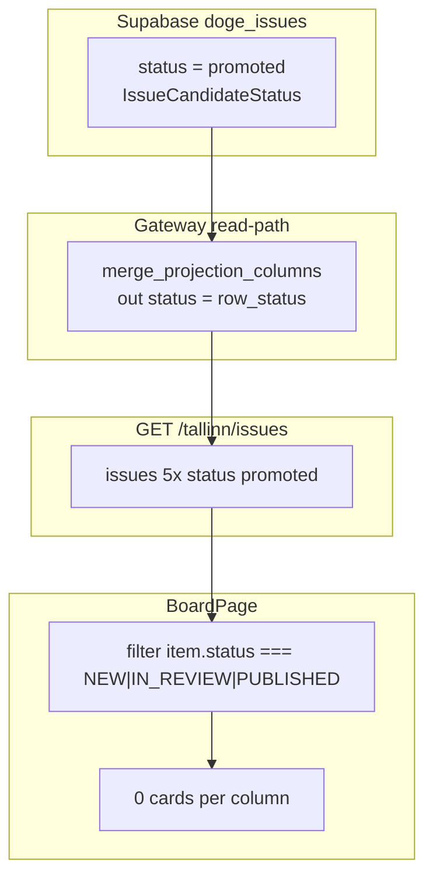

# Расследование: пустая доска spa-app `/#/board` (status vocabulary mismatch)

**Дата:** 2026-06-20  
**Scope:** end-to-end (spa-app + doge-complaints-gateway + hosted Supabase)  
**Симптом:** `http://localhost:5173/#/board` — три колонки NEW / IN REVIEW / PUBLISHED с счётчиками **0 / 0 / 0**, карточек нет, при этом gateway отвечает 200 и возвращает 5 issues.

**Связанные документы:**

- Предыдущий frontend-only отчёт (2026-06-19): [`spa-app/docs/analysis/report-empty-dashboard-gfl-driven-2026-06-19.md`](../../../../../spa-app/docs/analysis/report-empty-dashboard-gfl-driven-2026-06-19.md)
- Screenshot: [`spa-app/docs/analysis/validation/gfl-driven-board-empty-columns-2026-06-20.png`](../../../../../spa-app/docs/analysis/validation/gfl-driven-board-empty-columns-2026-06-20.png)

---

## Executive summary

| Слой | Статус | Доказательство |
|------|--------|----------------|
| SPA dev (`:5173`) | OK | Vite running; Puppeteer: `.board-shell`, 3 columns visible |
| Gateway (`:8000`) | OK | Terminal logs: `GET /tallinn/issues` → 200; startup `db_ready=True` |
| Fetch / CORS | OK | Browser fetch → 200; `access-control-allow-origin: *` |
| Данные в API | **5 issues** | `curl` + Puppeteer `fetch('/tallinn/issues')` |
| Карточки на доске | **0** | Puppeteer: `.issue-card` count = 0 |
| Корневая причина | **Status vocabulary mismatch** | API: `status: "promoted"`; SPA: только `NEW\|IN_REVIEW\|PUBLISHED` |

**Вывод:** цепочка SPA ↔ gateway **работает**. Проблема Jun-19 (отсутствие `id`/`status` в API) **закрыта** GW-RC-01. Текущий блокер — **невалидное значение `status`**: в `doge_issues.status` и API лежит `promoted` (enum promotion pipeline), а BoardPage раскладывает issues только по board-visible enum SPA.

---

## Симптом (UI)

- URL: `http://localhost:5173/#/board`
- Header «SYNCED», toolbar, search, filters — **отображаются**
- Колонки NEW / IN REVIEW / PUBLISHED — счётчики **0 / 0 / 0**
- Нет load-error (запрос успешен)
- Нет EmptyState «no issues recorded» (API вернул 5 issues — см. UX gap S3)
- Screenshot: [`gfl-driven-board-empty-columns-2026-06-20.png`](../../../../../spa-app/docs/analysis/validation/gfl-driven-board-empty-columns-2026-06-20.png)

---

## Цепочка разрыва



---

## Evidence chain (verified)

### E1. Puppeteer @ `http://localhost:5173/#/board`

| Метрика | Значение |
|---------|----------|
| `.issue-card` count | **0** |
| Column counts | NEW **0**, IN REVIEW **0**, PUBLISHED **0** |
| `.board-no-issues` | **absent** (`issues.length === 5`) |
| `.board-load-error` | **absent** |
| `.board-shell` / `.board-columns` | **present** |

Логика: [`spa-app/src/pages/BoardPage.jsx:167`](../../../../../spa-app/src/pages/BoardPage.jsx) — `showEmptyBoard = !loading && !hasActiveBoardFilters && issues.length === 0`. При несовпадении status пользователь видит **пустые колонки**, а не EmptyState.

Фильтр колонок: [`BoardPage.jsx:385-437`](../../../../../spa-app/src/pages/BoardPage.jsx) — `item.status === ISSUE_STATUS.NEW|IN_REVIEW|PUBLISHED`.

### E2. Live API (`curl` 2026-06-20)

```bash
curl -sS http://127.0.0.1:8000/tallinn/issues
```

| Метрика | Значение |
|---------|----------|
| HTTP | 200 |
| `data.issues.length` | **5** |
| Unique `status` values | **`["promoted"]`** |
| Keys in issue[0] | `created_at`, `description`, `id`, `labels`, `status`, `summary`, `title`, `type` |

Пример issue[0]:

```json
{
  "id": "test-7ef193be-dc51-4ddb-a582-24a6977dfd51",
  "status": "promoted",
  "type": "IMPROVEMENT",
  "title": { "en": "Road light issue", "et": "Teevalgusti mure", "ru": "Проблема с освещением" },
  "labels": ["infrastructure"],
  "created_at": "2026-05-11T11:44:21.773493+00:00"
}
```

### E3. Hosted Supabase (`doge_issues`, Public Node)

```sql
SELECT issue_id, status, issue_type, title_json, summary_json
FROM public.doge_issues
ORDER BY created_at DESC
LIMIT 5;
```

| issue_id | status | issue_type | title_json |
|----------|--------|------------|------------|
| test-7ef193be-... | promoted | improvement | populated |
| test-5e350194-... | promoted | IMPROVEMENT | `{}` |
| test-bdcae6aa-... | promoted | IMPROVEMENT | `{}` |
| test-9bc69528-... | promoted | IMPROVEMENT | `{}` |
| test-2f10a3c8-... | promoted | IMPROVEMENT | `{}` |

Все 5 записей — integration seeds (`test-*`). Колонка `payload_json` удалена (GW-RC-04).

### E4. SPA configuration (OK)

[`spa-app/.env`](../../../../../spa-app/.env):

```env
VITE_LIFE_REALITY_MODE=GFL-DRIVEN
VITE_GATEWAY_BASE_URL=http://127.0.0.1:8000
```

[`issueService.js:30-44`](../../../../../spa-app/src/services/issueService.js) → [`GatewayIssueRepository.js:76-79`](../../../../../spa-app/src/repositories/GatewayIssueRepository.js).

### E5. Gateway terminal (backend running)

Из логов `make dev` (terminal 2, 2026-06-20):

- `startup.persistence_backend backend=supabase db_ready=True`
- Множественные `GET /tallinn/issues HTTP/1.1" 200 OK`
- `supabase.request` / `supabase.response` DEBUG — PostgREST roundtrip успешен

---

## Root cause analysis

### RC-A: Два разных enum `status` в gateway

| Enum | Values | Где |
|------|--------|-----|
| [`DOGEIssueStatus`](../../../../src/core/projection/enums.py) | NEW, IN_REVIEW, **PUBLISHED** | SPA contract, projection DTO, validation |
| [`IssueCandidateStatus`](../../../../src/core/promotion/types.py) | draft, ready_for_review, in_review, **promoted**, rejected | Promotion pipeline, `issue_candidates` |

Read-path отдаёт колонку БД без маппинга:

```234:234:src/core/projection/read_filters.py
out["status"] = row_status
```

SPA ожидает только `DOGEIssueStatus` — [`spa-app/src/domain/types.js:3-7`](../../../../../spa-app/src/domain/types.js).

### RC-B: Write-path сохраняет candidate status в `doge_issues.status`

**Extend path (bug):**

```332:336:src/core/application/issue_create.py
self.issue_projection_store.save_projection(
    issue_id=updated.candidate_id,
    status=updated.status.value,  # → "promoted"
    payload=projection_payload,
```

**Create path (intent correct):** line 252 — `status=str(projection_payload.get("status", projection.status))` → должно быть PUBLISHED из projection.

**Tests закрепляют неверное значение:**

- [`tests/integration/supabase/test_spa_projection_supabase_roundtrip.py:29`](../../../../tests/integration/supabase/test_spa_projection_supabase_roundtrip.py) — seed `status="promoted"`
- [`tests/integration/supabase/test_supabase_live_full_pipeline_roundtrip.py:155`](../../../../tests/integration/supabase/test_supabase_live_full_pipeline_roundtrip.py) — assert `status == "promoted"`

### RC-C: GW-RC-03 audit gap

[`legacy-audit-five-records.md`](../../epics/EPIC-M2-06-spa-projection-and-i18n/stories/STORY-GW-RC-03-contract-guarantee-and-legacy-data/task-gw-rc-03-t02-legacy-sql-audit-five-live-records/legacy-audit-five-records.md) пометил `status` как «closed (RC-01)» — проверялось **наличие поля**, но не **валидность значения** для SPA board.

---

## Gap matrix vs отчёт 2026-06-19

| GAP (Jun-19) | Было | Сейчас (Jun-20) |
|--------------|------|-----------------|
| GAP-1 `id` missing | Blocker | **Closed** — API возвращает `id` |
| GAP-2 `status` missing | Blocker | **Reopened** — поле есть, значение **`promoted`** invalid |
| GAP-3 `type` lowercase | High | **Closed** — API: `IMPROVEMENT` (GW-RC-02) |
| GAP-4 `created_at` missing | Medium | **Closed** — present in API |

---

## Secondary issues (после fix status)

| ID | Issue | Impact |
|----|-------|--------|
| S1 | 4/5 rows: empty `title_json`/`summary_json` | Карточки с пустым текстом |
| S2 | `issue_type=improvement` in DB (1 row) | Low — read-path canonicalizes |
| S3 | UX: no EmptyState when issues exist but none match columns | Misleading 0/0/0 columns |

---

## Что исключено

| Гипотеза | Доказательство отказа |
|----------|----------------------|
| SPA в FAKE-OLD | `.env` = GFL-DRIVEN; gateway получает запросы |
| CORS / network | 200 OK; no load-error UI |
| Missing `id` (Jun-19) | API has `id` on all 5 |
| Columnar migration broke read | Structured API response; gateway logs OK |
| URL filters | Board query `(no query)`; all 5 returned |
| SPA dev down | Vite on `:5173`; Puppeteer OK |

---

## Test run log (2026-06-20)

```bash
cd spa-app && npm run test:ui:gfl-board
```

```
[gfl-smoke] gateway issues count=5 contract_violations=5
[gfl-smoke] API contract violations (backend fix required):
  - issues[0] invalid status "promoted"
  - issues[1] invalid status "promoted"
  - issues[2] invalid status "promoted"
  - issues[3] invalid status "promoted"
  - issues[4] invalid status "promoted"
[gfl-smoke] sample issue keys: type, labels, title, summary, description, id, status, created_at
```

Exit code: **1** (expected until backend fix).

Contract gate: [`spa-app/tests/puppeteer/gfl-driven-board-data-smoke.mjs`](../../../../../spa-app/tests/puppeteer/gfl-driven-board-data-smoke.mjs) — `ALLOWED_STATUS = NEW|IN_REVIEW|PUBLISHED`.

---

## Recommended fixes (backend — follow-up task)

### Fix 1 — Write path (required)

[`issue_create.py:334`](../../../../src/core/application/issue_create.py): использовать `projection.status` / `projection_payload["status"]`, **не** `updated.status.value`.

Обновить integration tests: ожидать `PUBLISHED` в `doge_issues.status`.

### Fix 2 — Read path canonicalization (defense in depth)

Добавить `canonicalize_status_on_read()` в [`read_filters.py`](../../../../src/core/projection/read_filters.py):

- `promoted` → `PUBLISHED` (documented alias)
- unknown → log + filter or map

Паттерн: GW-RC-02 `canonicalize_issue_type_on_read`.

### Fix 3 — Data migration (hosted Supabase)

```sql
UPDATE public.doge_issues SET status = 'PUBLISHED' WHERE status = 'promoted';
```

Reproject/backfill для rows с пустым `title_json` при необходимости.

### Fix 4 — Contract test gate

Расширить [`test_req24_tallinn_issues_read_api.py`](../../../../tests/test_req24_tallinn_issues_read_api.py): assert `status in {NEW, IN_REVIEW, PUBLISHED}`.

---

## Verification checklist (after fix)

```bash
# API contract
curl -sS http://127.0.0.1:8000/tallinn/issues | jq '.data.issues[].status' | sort -u
# expect: PUBLISHED (and/or NEW, IN_REVIEW)

# SPA smoke
cd spa-app && npm run test:ui:gfl-board   # exit 0

# Manual
open http://localhost:5173/#/board        # cards in PUBLISHED column
```

---

## Scope note

Этот документ — **analysis only**. Код gateway и SPA **не изменялся** в рамках расследования. Следующий шаг — implementation task по §Recommended fixes.
