# STORY-GW-DRAFT-05 — Dual intake contract (stash vs submit)

## Meta
- **Key:** `STORY-GW-DRAFT-05-dual-intake-contract-stash-vs-submit`
- **Пакет:** [`story-draft-handoff/`](./INDEX.md)
- **Status:** ⚪ Backlog
- **Приоритет:** 🟠 MED — поведение на проде уже работает (hotfix `87fc272`); цель — убрать техдолг и выровнять SSOT
- **Тип:** refactor (domain contracts + handlers + docs + tests)
- **Основание:** [`audit-gpt-story-drafts-submitter-domain-error-2026-07-08`](../../../analysis/audit-gpt-story-drafts-submitter-domain-error-2026-07-08.md) §5.2 (вариант C)
- **Зависит от:** [GW-DRAFT-01](./STORY-GW-DRAFT-01-story-draft-stash.md), [GW-DRAFT-02](./STORY-GW-DRAFT-02-browser-submit-verification-gate.md), GPT-SUBMIT-02 (GPT OpenAPI без submitter)
- **Разблокирует:** выравнивание runtime OpenAPI с GPT Actions v0.6.0; снятие placeholder `__stash_pending_author__`

## Зачем простыми словами
GPT кладёт черновик **без автора** — автор появляется только когда браузер сабмитит (из identity `/me`). Сейчас gateway обходит это через фиктивный `submitter` и magic string. Нужно два явных контракта: **stash** (без submitter) и **intake** (с submitter), с мостом только на границе submit.

## Что наблюдаю сейчас (verified по коду, hotfix `87fc272`)

| Элемент | As-is |
|---------|-------|
| [`contracts.py`](../../../../src/core/intake/contracts.py) | `STASH_PENDING_EXTERNAL_USER_ID = "__stash_pending_author__"`; `parse_story_intake_request(..., require_submitter=True/False)`; `parse_story_draft_stash_request()` → `StoryIntakeRequest` с placeholder |
| [`handlers.py`](../../../../src/core/api/handlers.py) | `handle_story_draft_create` сохраняет `dict(payload)`; `handle_story_intake` — ветка `stash_pending` при совпадении placeholder |
| GPT OpenAPI | [`StoryDraftStashRequest`](../../../../../GPT%20UI/docs/custom-gpt-story-intake-actions.openapi.yaml) — `required: [schema_version, narrative]`, **без submitter** |
| Runtime OpenAPI | [`openapi.yaml`](../../../runtime-docs/api-reference/openapi.yaml) L680–693: `POST /story-drafts` → `$ref: StoryIntakeRequest` (submitter required) — **drift** |
| Security SSOT | [`security-env-api-access.md`](../../../runtime-docs/security-env-api-access.md) §1.1 — «всегда требует submitter» для всех путей — **устарело** |
| Architecture SSOT | [`architecture-and-layers-as-is.md`](../../../runtime-docs/architecture-and-layers-as-is.md) L51 — stash = `StoryIntakeRequest` — **устарело** |

```mermaid
flowchart TB
  subgraph today [As-is hotfix]
    GPT[GPT POST /story-drafts] --> ParseFlag["parse_story_intake_request(require_submitter=False)"]
    ParseFlag --> Placeholder["StoryIntakeRequest + __stash_pending_author__"]
    Placeholder --> Store[(story_drafts JSON)]
    Store --> Submit["POST /submit + /me"]
    Submit --> IntakeParse["parse + stash_pending branch"]
    IntakeParse --> CreateStory[create_story]
  end

  subgraph target [GW-DRAFT-05 target]
    GPT2[GPT POST /story-drafts] --> StashParse["parse_story_draft_stash_request"]
    StashParse --> StashModel["StoryDraftStashRequest no submitter"]
    StashModel --> Store2[(story_drafts JSON)]
    Store2 --> Submit2["POST /submit + /me"]
    Submit2 --> Bridge["intake_request_from_stash_and_submitter"]
    Bridge --> IntakeModel["StoryIntakeRequest"]
    IntakeModel --> CreateStory2[create_story]
  end
```



## Требование / целевое состояние

### A. Domain types ([`contracts.py`](../../../../src/core/intake/contracts.py))

1. **`StoryDraftStashRequest`** — frozen dataclass **без** `submitter`: `schema_version`, `narrative`, optional `origin`, `privacy`, `live_story_context`, `gpt_signals`.
2. **`StoryIntakeRequest`** — семантика без изменений: **всегда** с `submitter` (legacy `/intake/stories` + финальный browser submit).
3. **Удалить:** `STASH_PENDING_EXTERNAL_USER_ID`, флаг `require_submitter`, возврат `StoryIntakeRequest` из `parse_story_draft_stash_request`.
4. **DRY:** общая валидация narrative/root-полей в `_parse_story_envelope_body(...)` — используют оба парсера.
5. **Мост на границе submit:**

```python
def intake_request_from_stash_and_submitter(
    stash: StoryDraftStashRequest,
    *,
    submitter: Submitter,
) -> StoryIntakeRequest: ...
```

Вызывается **только** в `handle_story_draft_submit` после `authoritative_submitter_from_introspection` — не через placeholder.

### B. Handlers ([`handlers.py`](../../../../src/core/api/handlers.py))

| Handler | Было | Станет |
|---------|------|--------|
| `handle_story_draft_create` | placeholder `StoryIntakeRequest` → `dict(payload)` | `parse` → `StoryDraftStashRequest` → `stash.as_dict()` в `StoryDraftRecord` |
| `handle_story_draft_submit` | `handle_story_intake(record.payload)` + `stash_pending` | parse stash → `intake_request_from_stash_and_submitter(..., authoritative)` → `handle_story_intake` |
| `handle_story_intake` | `require_submitter` + `stash_pending` | убрать обе ветки; **всегда** `parse_story_intake_request` (submitter required) |

### C. Экспорты ([`intake/__init__.py`](../../../../src/core/intake/__init__.py))

- Добавить `StoryDraftStashRequest`, `intake_request_from_stash_and_submitter`
- Удалить `STASH_PENDING_EXTERNAL_USER_ID`

## Подзадачи

| ID | Задача |
|----|--------|
| **T01** | Domain: `StoryDraftStashRequest` + shared parser + bridge; удалить placeholder/flag |
| **T02** | Handlers: stash/submit/intake wiring по таблице выше |
| **T03** | Fixtures: `valid_v2_stash_payload()` без submitter в [`intake_v2_fixtures.py`](../../../../tests/intake_v2_fixtures.py); `valid_v2_intake_payload()` оставить с submitter для legacy |
| **T04** | Тесты: `test_story_intake_contract.py`, `test_gw_draft_01_*`, `test_gw_draft_02_*` — assert тип `StoryDraftStashRequest`, отсутствие magic string, submit bridge с `/me` |
| **T05** | Runtime OpenAPI: schema `StoryDraftStashRequest` (без submitter); `POST /story-drafts` и `GET` response `$ref` на stash schema |
| **T06** | Runtime docs: [`API_REFERENCE.md`](../../../runtime-docs/api-reference/API_REFERENCE.md) §6.8, [`security-env-api-access.md`](../../../runtime-docs/security-env-api-access.md) §1.1 (три пути: legacy intake / GPT stash / browser submit), [`architecture-and-layers-as-is.md`](../../../runtime-docs/architecture-and-layers-as-is.md) |
| **T07** | Backlog sync: примечание в [GW-DRAFT-01](./STORY-GW-DRAFT-01-story-draft-stash.md) «тот же StoryIntakeRequest» → ссылка на GW-DRAFT-05; строка в [`INDEX.md`](./INDEX.md) |
| **T08** | Acceptance gate: grep `STASH_PENDING` = 0; `POST /story-drafts` hosted smoke без submitter → 201; browser submit → 202 + author=`sub` |

## Acceptance Criteria

- [ ] `STASH_PENDING_EXTERNAL_USER_ID` и `require_submitter` **удалены** из codebase (grep = 0)
- [ ] `parse_story_draft_stash_request` возвращает **`StoryDraftStashRequest`**, не `StoryIntakeRequest`
- [ ] `POST /story-drafts` принимает payload **без submitter**; stored JSON **не содержит** submitter/placeholder
- [ ] `POST /story-drafts/{id}/submit` собирает `StoryIntakeRequest` только на границе submit с authoritative submitter из `/me`
- [ ] Legacy `POST /intake/stories` по-прежнему требует submitter в payload (service channel)
- [ ] Runtime OpenAPI и security SSOT описывают **два** request-контракта (stash vs intake), lockstep с GPT OpenAPI v0.6.0
- [ ] Контракт-тесты GW-DRAFT-01/02 + intake contract зелёные; нет assert на magic placeholder

## Оценка элегантности

| Элемент | Hotfix (`87fc272`) | GW-DRAFT-05 |
|---------|-------------------|-------------|
| Типобезопасность | `StoryIntakeRequest` с fake submitter | Отдельный тип без submitter |
| Submit path | Magic string + branch в intake handler | Явный bridge на границе submit |
| Документация | Drift (runtime OpenAPI ≠ GPT OpenAPI) | Два контракта в SSOT |
| Риск регрессии | Низкий (уже на проде) | Покрывается GW-DRAFT-01/02 тестами + расширение |

## Вне scope

- Hosted Supabase migration pipeline для `story_drafts` (уже применена вручную при инциденте) — ops follow-up, не блокирует
- Изменения GPT UI instructions (уже корректны после GPT-SUBMIT-02)

## Runtime-docs дельта

- [`openapi.yaml`](../../../runtime-docs/api-reference/openapi.yaml) — `StoryDraftStashRequest` schema; paths `/story-drafts` POST/GET
- [`API_REFERENCE.md`](../../../runtime-docs/api-reference/API_REFERENCE.md) §6.8
- [`security-env-api-access.md`](../../../runtime-docs/security-env-api-access.md) §1.1 — три пути submitter linkage
- [`architecture-and-layers-as-is.md`](../../../runtime-docs/architecture-and-layers-as-is.md) §4.1
- [`story-persistence-model.md`](../../../runtime-docs/story-persistence-model.md) — `payload_json` = stash shape (без submitter)

## Швы

Контракты — [`intake/contracts.py`](../../../../src/core/intake/contracts.py); handlers — [`handlers.py`](../../../../src/core/api/handlers.py); автор на submit — [`authoritative_submitter.py`](../../../../src/core/identity/authoritative_submitter.py); GPT SSOT — [`custom-gpt-story-intake-actions.openapi.yaml`](../../../../../GPT%20UI/docs/custom-gpt-story-intake-actions.openapi.yaml).

## Зависимости / связь

Продолжение пакета [GW-DRAFT-01..04](./INDEX.md). Инцидент и hotfix: [`audit-gpt-story-drafts-submitter-domain-error-2026-07-08`](../../../analysis/audit-gpt-story-drafts-submitter-domain-error-2026-07-08.md). Обновляет устаревшее утверждение GW-DRAFT-01 «тот же `StoryIntakeRequest` для stash».
