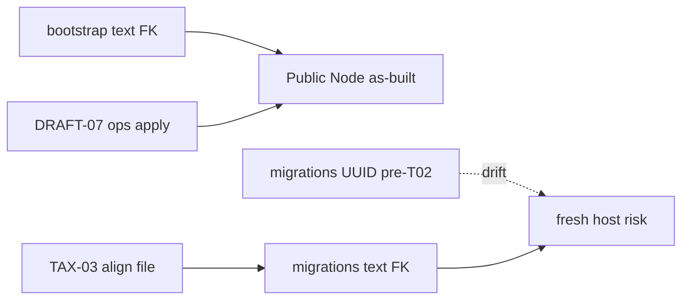

# STORY-GW-TAX-03 — Align `story_labels` migration to text FK

## Meta
- **Key:** `STORY-GW-TAX-03-align-story-labels-migration-text-fk`
- **Пакет:** [`taxonomy-fidelity/`](./INDEX.md)
- **Status:** 🔵 Done (Awaiting Commits) — gate PASS 2026-08-07T09:59:37Z pkg-000058; pipeline [`STORY-GW-TAX-03-…`](../../epics/EPIC-M2-23-taxonomy-fidelity/stories/STORY-GW-TAX-03-align-story-labels-migration-text-fk/STORY-GW-TAX-03-align-story-labels-migration-text-fk.md)
- **Приоритет:** ⚪ LOW — hygiene SSOT; Public Node уже text (DRAFT-07)
- **Тип:** docs / ops (migration SSOT)
- **Основание:** [elegance audit §6](../../../analysis/audit-gw-draft-07-architectural-elegance-2026-08-07.md); execution [G1](../../../analysis/audit-gw-draft-07-hosted-schema-blocks-browser-submit-2026-08-07.md)
- **Зависит от:** [GW-TAX-01](./STORY-GW-TAX-01-taxonomy-persistence-fidelity.md) Done; [GW-DRAFT-07](../story-draft-handoff/STORY-GW-DRAFT-07-hosted-schema-blocks-browser-submit.md) Done (hosted DDL already text)
- **Разблокирует:** безопасный fresh-host apply из `supabase/migrations/` без UUID/text drift
- **Не reopen:** GW-DRAFT-07

## Зачем простыми словами

На prod таблица `story_labels` уже с **text** FK (как bootstrap). **До TAX-03** repo-миграция TAX-01 объявляла `story_id UUID` — drift vs `stories.story_id` text, bootstrap и peer. Свежий host с UUID DDL рисковал дырой readiness. TAX-03 выровнял **repo SSOT** на text FK (edit in-place), не трогая живой Public Node path DRAFT-07.

## Текущее состояние (post-Done, after T02–T03)

| Источник | `story_labels.story_id` | Ref |
|----------|-------------------------|-----|
| Repo migration TAX-01 (post-TAX-03) | **text** FK + RLS + GRANT | [`20260714_1200_gw_tax_01_story_labels.sql:11`](../../../../supabase/migrations/20260714_1200_gw_tax_01_story_labels.sql) |
| Bootstrap канон | **text** FK | [`000_full_init.sql:86-94`](../../../../supabase/bootstrap/000_full_init.sql) |
| SQLite auto-DDL | **TEXT** | [`db_sqlite.py:385-391`](../../../../src/core/infrastructure/db_sqlite.py) |
| Peer `story_signals` | **text** FK | [`20260523_1200_req42_story_signals.sql:4`](../../../../supabase/migrations/20260523_1200_req42_story_signals.sql) |
| Hosted Public Node (post DRAFT-07) | **text** FK + RLS | elegance / execution audits 2026-08-07 |

## Что наблюдаю — pre-T02 UAT (historical)

> **Historical.** Снимок dual-path **до** edit in-place T02. Не текущее repo-состояние.

| Источник | `story_labels.story_id` | Ref |
|----------|-------------------------|-----|
| Repo migration TAX-01 (pre-T02) | **UUID** FK | pre-edit `20260714_…story_labels.sql` (было `:3` UUID DDL) |
| Bootstrap / sqlite / peer / hosted | **text** | см. T01 inventory |

## Требование / целевое состояние

1. [`20260714_1200_gw_tax_01_story_labels.sql`](../../../../supabase/migrations/20260714_1200_gw_tax_01_story_labels.sql) (или successor migration) объявляет `story_id text … REFERENCES stories(story_id)` + indexes, согласовано с bootstrap.
2. RLS + policy `service_role` + GRANT parity с [`000_full_init.sql`](../../../../supabase/bootstrap/000_full_init.sql) (или явный комментарий «RLS в bootstrap-only / follow-up»).
3. Guard-комментарий в migration: не apply UUID DDL на hosts с `stories.story_id = text`.
4. Fresh-host checklist в package INDEX / runtime note: migrations ∪ bootstrap согласованы.
5. **GW-DRAFT-07 не reopen**; hosted Public Node не требует повторного apply ради этой стори.

## Подзадачи (черновик → pipeline pkg-000058)

- **T01** — Inventory dual path → [`task-gw-tax-03-t01-inventory-dual-path`](../../epics/EPIC-M2-23-taxonomy-fidelity/stories/STORY-GW-TAX-03-align-story-labels-migration-text-fk/task-gw-tax-03-t01-inventory-dual-path/README.md)
- **T02** — Align repo migration DDL to text FK + indexes (**edit in-place**) → [`task-gw-tax-03-t02-align-migration-text-fk`](../../epics/EPIC-M2-23-taxonomy-fidelity/stories/STORY-GW-TAX-03-align-story-labels-migration-text-fk/task-gw-tax-03-t02-align-migration-text-fk/README.md)
- **T03** — RLS/GRANT parity bootstrap → [`task-gw-tax-03-t03-rls-grant-parity-bootstrap`](../../epics/EPIC-M2-23-taxonomy-fidelity/stories/STORY-GW-TAX-03-align-story-labels-migration-text-fk/task-gw-tax-03-t03-rls-grant-parity-bootstrap/README.md)
- **T04** — Docs: taxonomy INDEX + elegance G1 closed note → [`task-gw-tax-03-t04-docs-index-elegance-note`](../../epics/EPIC-M2-23-taxonomy-fidelity/stories/STORY-GW-TAX-03-align-story-labels-migration-text-fk/task-gw-tax-03-t04-docs-index-elegance-note/README.md)
- **T05** — Story acceptance gate → [`task-gw-tax-03-t05-story-acceptance-gate`](../../epics/EPIC-M2-23-taxonomy-fidelity/stories/STORY-GW-TAX-03-align-story-labels-migration-text-fk/task-gw-tax-03-t05-story-acceptance-gate/README.md)

## Acceptance Criteria

- [x] Repo migration path для `story_labels` использует **text** FK на `stories(story_id)`, не UUID.
- [x] Indexes `idx_story_labels_story` / `idx_story_labels_axis` сохранены или эквивалентны.
- [x] Комментарий/guard в SQL: UUID DDL несовместим с text `stories.story_id`.
- [x] Package INDEX отражает TAX-03 Done/Deferred закрытие dual-path.
- [x] DRAFT-07 **не** reopen; `REQUIRED_READINESS_TABLES` / FE / `/ready` gate **не** меняются ради этой стори.

## Границы

- **In scope:** repo `supabase/migrations` (+ docs) для `story_labels` type SSOT.
- **Вне scope:** ослабление readiness; bypass `db_ready`; SPA; GPT; изменение `REQUIRED_READINESS_TABLES`; повторный ops apply на уже исправленный Public Node (если не требуется corrective).

## Условие реактивации

- Планируется fresh Supabase host / CI migration apply **или** явный ops-запрос на выравнивание migrations SSOT.
- Не блокирует MVP value-loop (submit/board) после DRAFT-07.
