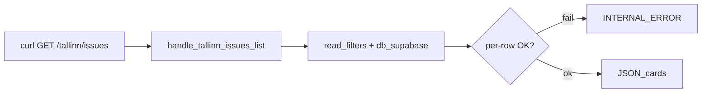

# STORY-GW-RC-07 — Hosted `/tallinn/issues` INTERNAL_ERROR regression

## Meta
- **Key:** `STORY-GW-RC-07`
- **Parent Epic:** [`../../../EPIC-M2-06-spa-projection-and-i18n.md`](../../../EPIC-M2-06-spa-projection-and-i18n.md)
- **Type:** Technical Story
- **Status:** 🔵 Done (Awaiting Commits)
- **Приоритет:** P1 Blocker (demo board broken on prod)
- **Тип:** fix / ops
- **source:** [`../../../../backlog-stories/issues-read-contract/STORY-GW-RC-07-hosted-tallinn-issues-internal-error.md`](../../../../backlog-stories/issues-read-contract/STORY-GW-RC-07-hosted-tallinn-issues-internal-error.md)
- **Закрывает:** CF-B из [`audit-gw-seed-02-dataset-expansion-for-clustering-2026-06-22.md`](../../../../../../analysis/audit-gw-seed-02-dataset-expansion-for-clustering-2026-06-22.md) §3
- **Основание:** audit CF-B; prior baseline [`tallinn-issues-live-response.json`](../STORY-GW-RC-06-hosted-status-data-hygiene/task-gw-rc-06-t04-verify-tallinn-issues-and-board-cards/tallinn-issues-live-response.json) (1 card, 2026-06-20)
- **Decision Ref:** backlog file above; audit CF-B
- **Operative queue:** [`../../../../gateway-active-packages/pkg-000047-20260710-gw-rc-07-hosted-tallinn-issues-internal-error.yaml`](../../../../gateway-active-packages/pkg-000047-20260710-gw-rc-07-hosted-tallinn-issues-internal-error.yaml) — **5** тасков T01–T05
- **Зависит от:** RC-01→06 (read-path baseline)
- **Блокирует:** [GW-SEED-03](../../../../backlog-stories/demo-data-seeding/STORY-GW-SEED-03-end-to-end-seed-runbook.md) hosted T03

## Зачем простыми словами
На hosted в БД уже **8** issue-карточек (cron сработал), но публичный `GET /tallinn/issues` отдаёт `INTERNAL_ERROR` — доска пустая/битая. Нужно найти причину (deploy drift, битая строка, read-path crash) и восстановить отдачу карточек.

## Что наблюдаю сейчас (verified, audit 2026-06-22)

- Live `GET https://dogestonia-tallinn.up.railway.app/tallinn/issues` → `{"error":{"code":"INTERNAL_ERROR",...}}` (HTTP 200, error body); trace_id `d7581fb1-…` ([`audit-gw-seed-02`](../../../../../../analysis/audit-gw-seed-02-dataset-expansion-for-clustering-2026-06-22.md) §CF-B).
- `/ready` green; hosted `doge_issues` = **8** PUBLISHED rows (7 new `INCIDENT` + legacy `test-7ef193be`).
- Local unit/sqlite read-path green; `INCIDENT` — valid `DOGEIssueType` ([`enums.py:19`](../../../../../../../src/core/projection/enums.py)).
- Read handler entry: [`handlers.py:368`](../../../../../../../src/core/api/handlers.py) `handle_tallinn_issues_list` → [`read_filters.py`](../../../../../../../src/core/projection/read_filters.py) / [`db_supabase.py`](../../../../../../../src/core/infrastructure/db_supabase.py).
- Route: [`asgi_app.py:429`](../../../../../../../src/core/api/asgi_app.py) `GET /tallinn/issues` (публичный, без auth deps).
- **⚠️ Live re-verify:** статус prod на дату audit; перед fix — повторить curl + trace_id (не выдумывать текущее состояние).

## Требование / целевое состояние

- Воспроизвести и зафиксировать ошибку (curl + logs по trace_id).
- Сверить версию gateway на Railway с локальной (RC-04→06 на проде).
- Изолировать проблемную строку/поле (per-row read probe).
- Исправить root cause (`src/core/` и/или data repair).
- Hosted verify: `GET /tallinn/issues` → валидный JSON с issue-карточками (≥1).

## Граница

- In scope: hosted read/serving path for board API.
- Out of scope: новый seed canvas (SEED-02); полный E2E runbook (SEED-03) до фикса CF-B.

## Nested tasks

| Order | Task folder | Wave |
|-------|-------------|------|
| 1 | [`task-gw-rc-07-t01-reproduce-and-collect-hosted-evidence`](./task-gw-rc-07-t01-reproduce-and-collect-hosted-evidence/README.md) | pkg-000047 |
| 2 | [`task-gw-rc-07-t02-deploy-version-parity-vs-local-rc`](./task-gw-rc-07-t02-deploy-version-parity-vs-local-rc/README.md) | pkg-000047 |
| 3 | [`task-gw-rc-07-t03-per-row-read-probe-seven-incident-issues`](./task-gw-rc-07-t03-per-row-read-probe-seven-incident-issues/README.md) | pkg-000047 |
| 4 | [`task-gw-rc-07-t04-fix-hosted-read-path-root-cause`](./task-gw-rc-07-t04-fix-hosted-read-path-root-cause/README.md) | pkg-000047 |
| 5 | [`task-gw-rc-07-t05-story-acceptance-gate`](./task-gw-rc-07-t05-story-acceptance-gate/README.md) | pkg-000047 |
| 6 | [`task-gw-rc-07-t06-correct-cf-b-root-cause-narrative-doc-sync`](./task-gw-rc-07-t06-correct-cf-b-root-cause-narrative-doc-sync/README.md) | audit override (`run_mode=gw_rc_07_audit_followup`) |
| 7 | [`task-gw-rc-07-t07-read-path-deploy-packaging-regression-guard`](./task-gw-rc-07-t07-read-path-deploy-packaging-regression-guard/README.md) | audit override |

## Acceptance Criteria

- [x] `hosted-internal-error-evidence.md`: воспроизведение CF-B задокументировано.
- [x] Root cause изолирован (T03) и исправлен (T04).
- [x] Hosted `GET /tallinn/issues` отдаёт валидные карточки (не `INTERNAL_ERROR`).
- [x] SEED-03 разблокирован для board-fill verify.

## Открытые вопросы (resolved 2026-07-10; corrected T06 audit G1)

- Deploy на Railway отстаёт от локального HEAD? → **Resolved 2026-07-10:** behavioral parity (9 cards, `/ready` green). June CF-B **causa undetermined**; not attributable to missing `columnar_storage` (import/file post-date CF-B).
- Какая из 8 строк ломает read-path? → **Resolved:** none on 2026-07-10 probe; per-row 9/9 OK.
- July missing-module incident? → **Separate:** GW-DRAFT-01 lazy import (`e832302`/`543a38b`); deploy caught up before P3 verify; guard → T07.

## Швы

- Route: [`asgi_app.py:429`](../../../../../../../src/core/api/asgi_app.py)
- Handler: [`handlers.py:368`](../../../../../../../src/core/api/handlers.py) `handle_tallinn_issues_list`
- Read path: [`read_filters.py`](../../../../../../../src/core/projection/read_filters.py), [`db_supabase.py`](../../../../../../../src/core/infrastructure/db_supabase.py)
- Active pkg: [`pkg-000047`](../../../../gateway-active-packages/pkg-000047-20260710-gw-rc-07-hosted-tallinn-issues-internal-error.yaml)
- Draft pkg (historical): [`pkg-000038`](../../../../gateway-active-packages/pkg-000038-20260622-gw-rc-07-hosted-tallinn-issues-internal-error.yaml)
