# STORY-GW-DRAFT-05 — Dual intake contract (stash vs submit)

## Meta
- **Key:** `STORY-GW-DRAFT-05-dual-intake-contract-stash-vs-submit`
- **Parent Epic:** [`../../../EPIC-M2-21-story-draft-handoff.md`](../../../EPIC-M2-21-story-draft-handoff.md)
- **Type:** refactor (domain contracts + handlers + docs + tests)
- **Status:** ⚪ Todo
- **Приоритет:** 🟠 MED — поведение на проде уже работает (hotfix `87fc272`); цель — убрать техдолг и выровнять SSOT
- **source:** [`../../../../backlog-stories/story-draft-handoff/STORY-GW-DRAFT-05-dual-intake-contract-stash-vs-submit.md`](../../../../backlog-stories/story-draft-handoff/STORY-GW-DRAFT-05-dual-intake-contract-stash-vs-submit.md)
- **Decision Ref:** backlog file above; [`audit-gpt-story-drafts-submitter-domain-error-2026-07-08`](../../../../../../analysis/audit-gpt-story-drafts-submitter-domain-error-2026-07-08.md) §5.2 (вариант C); hotfix `87fc272`
- **Operative queue:** [`../../../../gateway-active-packages/pkg-000049-20260711-gw-draft-05-dual-intake-contract-stash-vs-submit.yaml`](../../../../gateway-active-packages/pkg-000049-20260711-gw-draft-05-dual-intake-contract-stash-vs-submit.yaml) via [`../../../../gateway-active-package.current.yaml`](../../../../gateway-active-package.current.yaml) — **8** тасков T01–T08 (pkg); **T09** audit override
- **Audit (2026-07-11):** [`audit-gw-draft-05-dual-intake-contract-stash-vs-submit-2026-07-11`](../../../../../../analysis/audit-gw-draft-05-dual-intake-contract-stash-vs-submit-2026-07-11.md) — T01–T07 PASS; **G1 open** → T09; T08 gate pending after T09
- **Зависит от:** [GW-DRAFT-01](../../../../backlog-stories/story-draft-handoff/STORY-GW-DRAFT-01-story-draft-stash.md), [GW-DRAFT-02](../../../../backlog-stories/story-draft-handoff/STORY-GW-DRAFT-02-browser-submit-verification-gate.md), GPT-SUBMIT-02 (GPT OpenAPI без submitter)
- **Разблокирует:** [GW-DRAFT-06](../../../../backlog-stories/story-draft-handoff/STORY-GW-DRAFT-06-remove-legacy-intake-stories-route.md); выравнивание runtime OpenAPI с GPT Actions v0.6.0; снятие placeholder `__stash_pending_author__`

## Зачем простыми словами
GPT кладёт черновик **без автора** — автор появляется только когда браузер сабмитит (из identity `/me`). Сейчас gateway обходит это через фиктивный `submitter` и magic string. Нужно два явных контракта: **stash** (без submitter) и **intake** (с submitter), с мостом только на границе submit.

## Что наблюдаю сейчас (post-P3 T01–T07; audit 2026-07-11)

| Элемент | As-is (verified) |
|---------|------------------|
| [`contracts.py`](../../../../../../src/core/intake/contracts.py) | `StoryDraftStashRequest` + `StoryIntakeRequest`; bridge `intake_request_from_stash_and_submitter`; **G1:** legacy value via `"".join(...)` at :18 — audit follow-up T09 |
| [`handlers.py`](../../../../../../src/core/api/handlers.py) | create→`stash.as_dict()`; submit→bridge; intake→`parse_story_intake_request` (no `stash_pending`) |
| Runtime OpenAPI | `StoryDraftStashRequest` on POST/GET `/story-drafts` — aligned with GPT |
| SSOT docs | dual-path stash vs intake — T06 Done |

_Pre-P3 as-is table (hotfix `87fc272`) superseded by T01–T07; see git history if needed._

```mermaid
flowchart TB
  subgraph today [As-is hotfix]
    GPT[GPT POST /story-drafts] --> ParseFlag["parse_story_intake_request(require_submitter=False)"]
    ParseFlag --> Placeholder["StoryIntakeRequest + __stash_pending_author__"]
    Placeholder --> Store[(story_drafts JSON)]
    Store --> Submit["POST /submit + /me"]
    Submit --> IntakeParse["parse + stash_pending branch"]
    IntakeParse --> CreateStory[create_story]
  end

  subgraph target [GW-DRAFT-05 target]
    GPT2[GPT POST /story-drafts] --> StashParse["parse_story_draft_stash_request"]
    StashParse --> StashModel["StoryDraftStashRequest no submitter"]
    StashModel --> Store2[(story_drafts JSON)]
    Store2 --> Submit2["POST /submit + /me"]
    Submit2 --> Bridge["intake_request_from_stash_and_submitter"]
    Bridge --> IntakeModel["StoryIntakeRequest"]
    IntakeModel --> CreateStory2[create_story]
  end
```



## Требование / целевое состояние

### A. Domain types ([`contracts.py`](../../../../../../src/core/intake/contracts.py))

1. **`StoryDraftStashRequest`** — frozen dataclass **без** `submitter`: `schema_version`, `narrative`, optional `origin`, `privacy`, `live_story_context`, `gpt_signals`.
2. **`StoryIntakeRequest`** — **всегда** с `submitter`; используется только на границе submit-bridge (internal), не как публичный GPT stash contract.
3. **Удалить:** `STASH_PENDING_EXTERNAL_USER_ID`, флаг `require_submitter`, возврат `StoryIntakeRequest` из `parse_story_draft_stash_request`.
4. **DRY:** общая валидация narrative/root-полей в `_parse_story_envelope_body(...)` — используют оба парсера.
5. **Мост на границе submit:**

```python
def intake_request_from_stash_and_submitter(
    stash: StoryDraftStashRequest,
    *,
    submitter: Submitter,
) -> StoryIntakeRequest: ...
```

Вызывается **только** в `handle_story_draft_submit` после `authoritative_submitter_from_introspection` — не через placeholder.

### B. Handlers ([`handlers.py`](../../../../../../src/core/api/handlers.py))

| Handler | Было | Станет |
|---------|------|--------|
| `handle_story_draft_create` | placeholder `StoryIntakeRequest` → `dict(payload)` | `parse` → `StoryDraftStashRequest` → `stash.as_dict()` в `StoryDraftRecord` |
| `handle_story_draft_submit` | `handle_story_intake(record.payload)` + `stash_pending` | parse stash → `intake_request_from_stash_and_submitter(..., authoritative)` → `handle_story_intake` |
| `handle_story_intake` | `require_submitter` + `stash_pending` | убрать обе ветки; **всегда** `parse_story_intake_request` (submitter required) |

### C. Экспорты ([`intake/__init__.py`](../../../../../../src/core/intake/__init__.py))

- Добавить `StoryDraftStashRequest`, `intake_request_from_stash_and_submitter`
- Удалить `STASH_PENDING_EXTERNAL_USER_ID`

## Nested tasks

| Order | Task folder | Wave |
|-------|-------------|------|
| 1 | [`task-gw-draft-05-t01-domain-stash-request-bridge-and-cleanup`](./task-gw-draft-05-t01-domain-stash-request-bridge-and-cleanup/README.md) | pkg-000049 |
| 2 | [`task-gw-draft-05-t02-handlers-stash-submit-intake-wiring`](./task-gw-draft-05-t02-handlers-stash-submit-intake-wiring/README.md) | pkg-000049 |
| 3 | [`task-gw-draft-05-t03-intake-v2-fixtures-stash-payload`](./task-gw-draft-05-t03-intake-v2-fixtures-stash-payload/README.md) | pkg-000049 |
| 4 | [`task-gw-draft-05-t04-contract-and-draft-regression-tests`](./task-gw-draft-05-t04-contract-and-draft-regression-tests/README.md) | pkg-000049 |
| 5 | [`task-gw-draft-05-t05-runtime-openapi-stash-schema`](./task-gw-draft-05-t05-runtime-openapi-stash-schema/README.md) | pkg-000049 |
| 6 | [`task-gw-draft-05-t06-runtime-docs-dual-path-ssot`](./task-gw-draft-05-t06-runtime-docs-dual-path-ssot/README.md) | pkg-000049 |
| 7 | [`task-gw-draft-05-t07-backlog-index-sync`](./task-gw-draft-05-t07-backlog-index-sync/README.md) | pkg-000049 |
| 8 | [`task-gw-draft-05-t08-story-acceptance-gate`](./task-gw-draft-05-t08-story-acceptance-gate/README.md) | pkg-000049 |
| 9 | [`task-gw-draft-05-t09-audit-g1-honest-legacy-placeholder-ac`](./task-gw-draft-05-t09-audit-g1-honest-legacy-placeholder-ac/README.md) | audit override (not in pkg-000049) |

## Acceptance Criteria

- [x] `STASH_PENDING_EXTERNAL_USER_ID` и `require_submitter` **удалены** (`rg 'STASH_PENDING|require_submitter|\bstash_pending\b'` в `src/` `tests/` = 0); legacy `__stash_pending_author__` только в tolerant-read strip — audit G1 closed in T09
- [x] `parse_story_draft_stash_request` возвращает **`StoryDraftStashRequest`**, не `StoryIntakeRequest`
- [x] `POST /story-drafts` принимает payload **без submitter**; stored JSON **не содержит** submitter/placeholder
- [x] `POST /story-drafts/{id}/submit` собирает `StoryIntakeRequest` только на границе submit с authoritative submitter из `/me`
- [x] Runtime OpenAPI и security SSOT описывают **два** request-контракта (stash vs intake bridge), lockstep с GPT OpenAPI v0.6.0
- [x] Контракт-тесты GW-DRAFT-01/02 + intake contract зелёные; нет assert на magic placeholder

## Открытые вопросы

- Backward-compat: черновики в БД с placeholder `__stash_pending_author__` — миграция или tolerant read на submit? → решить в T02.
- Публичный `POST /intake/stories` — **не целевой путь**; удаление → [GW-DRAFT-06](../../../../backlog-stories/story-draft-handoff/STORY-GW-DRAFT-06-remove-legacy-intake-stories-route.md) после этой стори.

## Вне scope

- Hosted Supabase migration pipeline для `story_drafts` (уже применена вручную при инциденте) — ops follow-up, не блокирует
- Изменения GPT UI instructions (уже корректны после GPT-SUBMIT-02)

## Runtime-docs дельта

- [`openapi.yaml`](../../../../../runtime-docs/api-reference/openapi.yaml) — `StoryDraftStashRequest` schema; paths `/story-drafts` POST/GET
- [`API_REFERENCE.md`](../../../../../runtime-docs/api-reference/API_REFERENCE.md) §6.8
- [`security-env-api-access.md`](../../../../../runtime-docs/security-env-api-access.md) §1.1 — два пути submitter linkage (stash / browser submit)
- [`architecture-and-layers-as-is.md`](../../../../../runtime-docs/architecture-and-layers-as-is.md) §4.1
- [`story-persistence-model.md`](../../../../../runtime-docs/story-persistence-model.md) — `payload_json` = stash shape (без submitter)

## Швы

Контракты — [`intake/contracts.py`](../../../../../../src/core/intake/contracts.py); handlers — [`handlers.py`](../../../../../../src/core/api/handlers.py); автор на submit — [`authoritative_submitter.py`](../../../../../../src/core/identity/authoritative_submitter.py); GPT SSOT — [`custom-gpt-story-intake-actions.openapi.yaml`](../../../../../../../GPT%20UI/docs/custom-gpt-story-intake-actions.openapi.yaml).

## Зависимости / связь

Продолжение пакета [GW-DRAFT-01..04](../../../../backlog-stories/story-draft-handoff/INDEX.md). Инцидент и hotfix: [`audit-gpt-story-drafts-submitter-domain-error-2026-07-08`](../../../../../../analysis/audit-gpt-story-drafts-submitter-domain-error-2026-07-08.md). Обновляет устаревшее утверждение GW-DRAFT-01 «тот же `StoryIntakeRequest` для stash».
