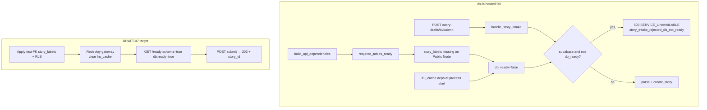

# STORY-GW-DRAFT-07 — Hosted schema blocks browser submit

## Meta
- **Key:** `STORY-GW-DRAFT-07-hosted-schema-blocks-browser-submit`
- **Parent Epic:** [`../../../EPIC-M2-21-story-draft-handoff.md`](../../../EPIC-M2-21-story-draft-handoff.md)
- **Type:** fix / ops (hosted schema readiness)
- **Status:** 🔵 Done (Awaiting Commits) — gate PASS 2026-08-07T07:04:17Z pkg-000056
- **Приоритет:** 🔴 P0 — demo / value-loop blocker (browser publish)
- **source:** [`../../../../backlog-stories/story-draft-handoff/STORY-GW-DRAFT-07-hosted-schema-blocks-browser-submit.md`](../../../../backlog-stories/story-draft-handoff/STORY-GW-DRAFT-07-hosted-schema-blocks-browser-submit.md)
- **Decision Ref:** backlog file above; pin [`pin-STORY-SPA-BUG-01-root-cause-2026-08-06.md`](../../../../../../spa-app/docs/analysis/pin-STORY-SPA-BUG-01-root-cause-2026-08-06.md); evidence [`evidence-STORY-SPA-BUG-01-submit-http-2026-08-06T201810Z.md`](../../../../../../spa-app/docs/analysis/evidence-STORY-SPA-BUG-01-submit-http-2026-08-06T201810Z.md); [GW-DRAFT-02](../../../../backlog-stories/story-draft-handoff/STORY-GW-DRAFT-02-browser-submit-verification-gate.md); [GW-TAX-01](../../../../backlog-stories/taxonomy-fidelity/STORY-GW-TAX-01-taxonomy-persistence-fidelity.md) (D-TAX-2 · таблица `story_labels`)
- **Operative queue:** [`../../../../gateway-active-packages/pkg-000056-20260806-gw-draft-07-hosted-schema-blocks-browser-submit.yaml`](../../../../gateway-active-packages/pkg-000056-20260806-gw-draft-07-hosted-schema-blocks-browser-submit.yaml) via [`../../../../gateway-active-package.current.yaml`](../../../../gateway-active-package.current.yaml) — **6** тасков T01–T06
- **Пакет:** [`story-draft-handoff/`](../../../../backlog-stories/story-draft-handoff/INDEX.md)
- **Связано с:** [STORY-SPA-BUG-01](../../../../../../spa-app/docs/tasks/backlog-stories/bugs/STORY-SPA-BUG-01-story-submission-unavailable.md); [GW-DRAFT-02](../../../../backlog-stories/story-draft-handoff/STORY-GW-DRAFT-02-browser-submit-verification-gate.md); [GW-TAX-01](../../../../backlog-stories/taxonomy-fidelity/STORY-GW-TAX-01-taxonomy-persistence-fidelity.md)
- **Зависит от:** [GW-DRAFT-01](../../../../backlog-stories/story-draft-handoff/STORY-GW-DRAFT-01-story-draft-stash.md)/[02](../../../../backlog-stories/story-draft-handoff/STORY-GW-DRAFT-02-browser-submit-verification-gate.md) Done (роуты стеша/сабмита); TAX-01 **код** Done; **hosted DDL для `story_labels` applied** (DRAFT-07 T02, text FK)
- **Разблокирует:** FE-HANDOFF-03 / [SPA-BUG-01](../../../../../../spa-app/docs/tasks/backlog-stories/bugs/STORY-SPA-BUG-01-story-submission-unavailable.md) retest → 202 (без FE-only hotfix)

## Зачем простыми словами

Verified-пользователь открывает черновик в SPA — preview полный. Нажимает **Submit** → «сервис недоступен»; Retry то же. История не публикуется. Ломается последний шаг handoff (GPT → SPA → publish), хотя draft и auth живы. Root cause — не SPA: на Public Node нет таблицы `story_labels`, gateway считает БД не готовой и режет intake 503.

## Что наблюдаю сейчас — pre-fix UAT 2026-08-06 (historical)

> **Historical.** Снимок до T02–T04. Не текущее hosted-состояние.

## Текущее состояние (post-Done, after T02–T05)

| Элемент | As-is | Ref |
|---------|-------|-----|
| Live `/ready` | `status=ready`, `db.ready=true`, `checks.schema=true` | T04; evidence 2026-08-07 |
| Live submit | `POST …/submit` → **202** + `story_id` | T05 evidence |
| Retry same draft | idempotent **202** + same `story_id` (`_story_intake_replay_from_idempotency`); GET draft → **404** | [`handlers.py:656-713`](../../../../../../src/core/api/handlers.py) |
| Hosted `story_labels` | text FK → `stories(story_id)`; RLS + `service_role` policy | T02 DDL `draft_07_story_labels_text_fk` |

## Pre-fix snapshot (UAT 2026-08-06)

| Элемент | As-is | Ref |
|---------|-------|-----|
| Live preview | `GET /story-drafts/{id}` → **200** (draft filled) | [evidence T01](../../../../../../spa-app/docs/analysis/evidence-STORY-SPA-BUG-01-submit-http-2026-08-06T201810Z.md) |
| Live submit | `POST /story-drafts/{id}/submit` → **503** `SERVICE_UNAVAILABLE` · message «Persistence backend is not ready…» · `checks.schema: false` (connectivity / columns / columns_geo_admin / columns_v2 / policy_probe **true**) | evidence body |
| Live `/ready` | `status=degraded`, `db.ready=false`, `checks.schema=false` | pin T02 |
| Intake gate | `db_backend==supabase` и `not db_ready` → envelope + log `story_intake_rejected_db_not_ready` → **503** | [`handlers.py:159-182`](../../../../../../src/core/api/handlers.py) |
| Readiness build | `db_checks.schema` = `required_tables_ready()`; `db_ready = all(db_checks.values())` | [`dependencies.py:75-83`](../../../../../../src/core/api/dependencies.py) |
| Required tables | `REQUIRED_READINESS_TABLES` включает **`story_labels`** (+ stories, drafts, embeddings, …) | [`db_supabase.py:29-43`](../../../../../../src/core/infrastructure/db_supabase.py) |
| Table probe | `GET /rest/v1/{table}?select=*&limit=1` для каждой required; любая ошибка → `schema=false` | [`db_supabase.py:293-303`](../../../../../../src/core/infrastructure/db_supabase.py) |
| Deps cache | `get_api_dependencies` → `_cached_dependencies` **`@lru_cache(maxsize=1)`** — `db_ready` заморожен до рестарта процесса | [`asgi_app.py:228-238`](../../../../../../src/core/api/asgi_app.py) |
| Public Node inventory | все readiness-таблицы на месте **кроме `story_labels`** | pin §Mechanism |
| Repo UUID migration | `story_id UUID REFERENCES stories(story_id)` — **несовместимо** с hosted `stories.story_id` = **text** | [`20260714_1200_gw_tax_01_story_labels.sql`](../../../../../../supabase/migrations/20260714_1200_gw_tax_01_story_labels.sql) |
| Bootstrap DDL (канон для host) | `story_id text … REFERENCES public.stories(story_id)` + RLS | [`bootstrap/000_full_init.sql:86-94`](../../../../../../supabase/bootstrap/000_full_init.sql), policies `:325-331` |
| SPA symptom | `mapDraftErrorPhase`: 503 → `SERVICE_DOWN` / `story-handoff-service-down` — UI-маппинг, не root cause | [SPA-BUG-01](../../../../../../spa-app/docs/tasks/backlog-stories/bugs/STORY-SPA-BUG-01-story-submission-unavailable.md) |

## Требование / целевое состояние

1. Hosted Supabase (Public Node, таргет Railway gateway) имеет таблицу `story_labels` в форме, совместимой с hosted `stories.story_id` (**text** FK), плюс RLS/policy `service_role` и GRANT по канону bootstrap.
2. **Не** применять as-is UUID DDL из [`20260714_1200_gw_tax_01_story_labels.sql`](../../../../../../supabase/migrations/20260714_1200_gw_tax_01_story_labels.sql) на этот host — FK на text `story_id` упадёт.
3. После DDL — **redeploy/restart** gateway: [`asgi_app.py:228-230`](../../../../../../src/core/api/asgi_app.py) кэширует `ApiDependencies` (`db_ready`) на старте; flip схемы без рестарта не обновляет readiness.
4. `GET /ready` → `db.ready=true`, `checks.schema=true`.
5. Verified browser `POST /story-drafts/{id}/submit` на валидном draft → **202** + `story_id`; draft consumed; история на заявленной MVP-поверхности.
6. SPA FE-HANDOFF-03 / BUG-01 разблокированы без FE-only hotfix (симптом UI — маппинг 503, не root cause).

## Nested tasks

| Order | Task folder | Wave |
|-------|-------------|------|
| 1 | [`task-gw-draft-07-t01-hosted-readiness-table-inventory`](./task-gw-draft-07-t01-hosted-readiness-table-inventory/README.md) | pkg-000056 |
| 2 | [`task-gw-draft-07-t02-apply-story-labels-text-fk-ddl`](./task-gw-draft-07-t02-apply-story-labels-text-fk-ddl/README.md) | pkg-000056 |
| 3 | [`task-gw-draft-07-t03-redeploy-gateway-clear-deps-cache`](./task-gw-draft-07-t03-redeploy-gateway-clear-deps-cache/README.md) | pkg-000056 |
| 4 | [`task-gw-draft-07-t04-verify-ready-schema-db-ready`](./task-gw-draft-07-t04-verify-ready-schema-db-ready/README.md) | pkg-000056 |
| 5 | [`task-gw-draft-07-t05-browser-submit-smoke-and-evidence`](./task-gw-draft-07-t05-browser-submit-smoke-and-evidence/README.md) | pkg-000056 |
| 6 | [`task-gw-draft-07-t06-story-acceptance-gate`](./task-gw-draft-07-t06-story-acceptance-gate/README.md) | pkg-000056 |
| 7 | [`task-gw-draft-07-t07-audit-r1-ac-retry-wording-align`](./task-gw-draft-07-t07-audit-r1-ac-retry-wording-align/README.md) | pkg-000057 audit follow-up |
| 8 | [`task-gw-draft-07-t08-audit-r2-post-done-as-is-tense`](./task-gw-draft-07-t08-audit-r2-post-done-as-is-tense/README.md) | pkg-000057 audit follow-up |
| 9 | [`task-gw-draft-07-t09-audit-g4-required-story-labels-assert`](./task-gw-draft-07-t09-audit-g4-required-story-labels-assert/README.md) | pkg-000057 audit follow-up |
| 10 | [`task-gw-draft-07-t10-audit-g3-spa-bug-01-unblock-pointer`](./task-gw-draft-07-t10-audit-g3-spa-bug-01-unblock-pointer/README.md) | pkg-000057 audit follow-up |

## Acceptance Criteria

- [x] `GET https://dogestonia-tallinn.up.railway.app/ready` → `db.ready: true`, `checks.schema: true`.
- [x] Verified user + filled draft: Submit → **202** (не 503 `service_down` на happy path).
- [x] Повторный Submit того же consumed draft — idempotent **202** + same `story_id` (без ложной второй публикации); GET draft → **404**.
- [x] Evidence artifact в `doge-complaints-gateway/docs/analysis/` (sanitized ready JSON + submit 202 trace_id) после Done.
- [x] FE-HANDOFF-03 / [SPA-BUG-01](../../../../../../spa-app/docs/tasks/backlog-stories/bugs/STORY-SPA-BUG-01-story-submission-unavailable.md) могут закрыть regression на новом draft после этого Done.

## Швы

| Шов | Где |
|-----|-----|
| Submit → intake | [`handlers.py`](../../../../../../src/core/api/handlers.py) `handle_story_draft_submit` → `handle_story_intake` |
| db_ready gate | [`handlers.py:159-182`](../../../../../../src/core/api/handlers.py) |
| Readiness assembly | [`dependencies.py:51-83`](../../../../../../src/core/api/dependencies.py) |
| Table set / probe | [`db_supabase.py:29-43`](../../../../../../src/core/infrastructure/db_supabase.py), [`:293-303`](../../../../../../src/core/infrastructure/db_supabase.py) |
| Process cache | [`asgi_app.py:228-238`](../../../../../../src/core/api/asgi_app.py) `_cached_dependencies` |
| DDL канон | [`bootstrap/000_full_init.sql`](../../../../../../supabase/bootstrap/000_full_init.sql) · proposed SQL в appendix |
| SPA symptom only | `mapDraftErrorPhase` 503 → `SERVICE_DOWN` (не чинить в этой стори) |

## Граница и контракт

- **In scope:** hosted schema для readiness (`story_labels` + RLS/grants по канону bootstrap); проверка `/ready`; redeploy/restart gateway; verify browser submit; evidence artifact.
- **Вне scope:** правки SPA UI; GPT OpenAPI; identity; переписывание UUID-миграций на других host; полный rewrite TAX/clustering; изменение `REQUIRED_READINESS_TABLES` в коде (таблица должна появиться, не исключаться).

## Открытые вопросы

- ~~Follow-up: UUID migration text hosts~~ → **[GW-TAX-03](../../../../backlog-stories/taxonomy-fidelity/STORY-GW-TAX-03-align-story-labels-migration-text-fk.md)** Deferred (P5 G1 WAIVED → existing story).
- Кто владеет apply DDL на Public Node (`lvfrdtglpksmaywqlohj`) в операционном runbook — gateway operator vs Supabase admin?

## Appendix — предложение миграции (не apply в docs-волне)

Оператор применяет в **gateway** / ops сессии. Файл:

[`proposed-migration-DRAFT-07-story-labels-text-fk.sql`](../../../../backlog-stories/story-draft-handoff/proposed-migration-DRAFT-07-story-labels-text-fk.sql)

**Обоснование:** создать `public.story_labels` с **text** FK на `stories(story_id)`, индексы, RLS + policy `service_role`, GRANT — как [`bootstrap/000_full_init.sql`](../../../../../../supabase/bootstrap/000_full_init.sql). Не копировать as-is UUID DDL из `supabase/migrations/20260714_1200_gw_tax_01_story_labels.sql` на этот host. После DDL — redeploy gateway (`lru_cache` readiness).
