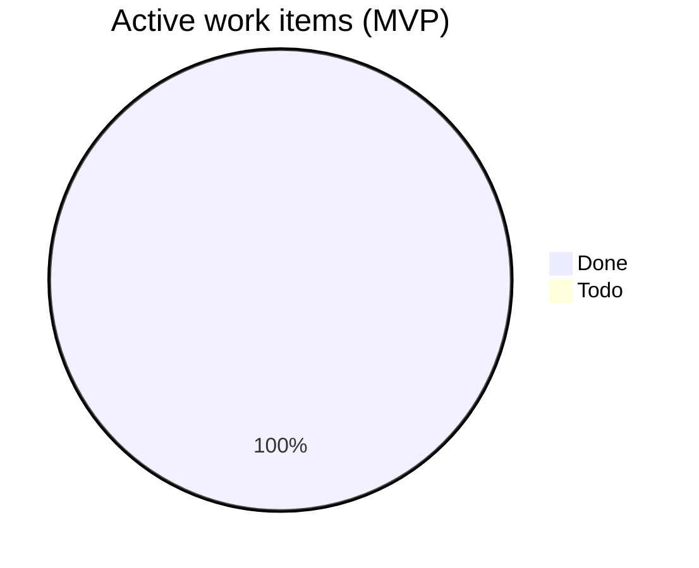

# Gateway · scope dashboard

> **Scope-Id:** mvp  
> **Scope:** MVP  
> **SSOT:** package `INDEX.md` files + [bullrun-launch-index.md](bullrun-launch-index.md)  
> **Updated:** 2026-08-10  
> **Last change:** **P3 ES-03 Done** pkg-000060 (REQ-50 `GET /tallinn/emerging-signals`); ES-02 Done pkg-000059; active **34/35 (~97%)**.

## Summary

| Metric | Value |
|--------|-------|
| Backlog packages | 8 |
| Active work items | 35 |
| Done | 34 |
| Todo / In Progress | 1 |
| Deferred | 3 |
| **Overall progress (active)** | **~97%** `████████████░` |

*Active = 30 product stories Done + 4 doc-tasks Done (3 legacy + TASK-ES-01) + 1 Task Todo (TASK-ES-04). Deferred вне %.*  
*REQ-49 Pulse + REQ-50 Emerging. [ES-02](backlog-stories/early-signal-pre-cluster/STORY-GW-ES-02-public-network-pulse-l1-aggregates.md) Done; [ES-03](backlog-stories/early-signal-pre-cluster/STORY-GW-ES-03-public-emerging-l2-read.md) Done pkg-000060; TASK-ES-04 Todo.*

## By package

| Package | Stories | Done | Todo | Deferred | Progress |
|---------|---------|------|------|----------|----------|
| [story-draft-handoff](backlog-stories/story-draft-handoff/INDEX.md) | 7 | 7 | 0 | 0 | 100% `████████████` |
| [issues-read-contract](backlog-stories/issues-read-contract/INDEX.md) | 8 | 8 | 0 | 0 | 100% `████████████` |
| [demo-data-seeding](backlog-stories/demo-data-seeding/INDEX.md) | 4 | 4 | 0 | 0 | 100% `████████████` |
| [localization-l10n](backlog-stories/localization-l10n/INDEX.md) | 4 | 3 | 0 | 1 | 75% `█████████░░░` |
| [gpt-submit-authz](backlog-stories/gpt-submit-authz/INDEX.md) | 2 | 2 | 0 | 0 | 100% `████████████` |
| [cabinet-api](backlog-stories/cabinet-api/INDEX.md) | 3 | 2 | 0 | 1 | 67% `████████░░░░` |
| [taxonomy-fidelity](backlog-stories/taxonomy-fidelity/INDEX.md) | 4 | 3 | 0 | 1 | 100% active `████████████` |
| [early-signal-pre-cluster](backlog-stories/early-signal-pre-cluster/INDEX.md) | 4 items | 3 | 1 | 0 | 75% `█████████░░░` |

*gpt-submit-authz: GAUTH-01/02 Superseded — excluded from story counts.*  
*cabinet-api: GW-CAB-03 Deferred (post-MVP web3).*  
*taxonomy-fidelity: TAX-01/02/03 Done; **TAX-04 Deferred** (ALTER residual UUID hosts).*  
*early-signal-pre-cluster: **TASK-ES-01 Done**; **ES-02 Done** pkg-000059; **ES-03 Done** pkg-000060 (`GET /tallinn/emerging-signals`); TASK-ES-04 Todo.*

## Remaining

| Type | Key | Title | Package/Epic | Status | Priority | Essence |
|------|-----|-------|--------------|--------|----------|---------|
| Task | [TASK-GW-ES-04](backlog-stories/early-signal-pre-cluster/TASK-GW-ES-04-req48-spa15-contract-seam.md) | REQ-48 PA.2 + spa-15 seam | early-signal | ⚪ Todo | — | Docs/contract; no API |

## Requirements (intake)

| REQ | Title | Status | Notes |
|-----|-------|--------|-------|
| [48](../requirements/48-early-signal-pre-cluster-data-readiness.md) | Early Signal / Pre-Cluster — Data Readiness (no invented API) | Draft — awaiting PA.2 | [TASK-ES-01](backlog-stories/early-signal-pre-cluster/TASK-GW-ES-01-early-signal-data-readiness-inventory.md) Done; [ES-02](backlog-stories/early-signal-pre-cluster/STORY-GW-ES-02-public-network-pulse-l1-aggregates.md) **Done** (`GET /tallinn/network-pulse`, REQ-49); [ES-03](backlog-stories/early-signal-pre-cluster/STORY-GW-ES-03-public-emerging-l2-read.md) **Done** pkg-000060 (`GET /tallinn/emerging-signals`, REQ-50); [TASK-ES-04](backlog-stories/early-signal-pre-cluster/TASK-GW-ES-04-req48-spa15-contract-seam.md) Todo; sibling [spa 15](../../../spa-app/docs/requirements/15-early-signal-pre-cluster-public-dashboard.md) |

## Doc-tasks Done (в active %)

| Key | Package | Evidence |
|-----|---------|----------|
| [DOC-TASK-CRON-SCOPE-01](backlog-stories/demo-data-seeding/DOC-TASK-CRON-SCOPE-01-clarify-cron-in-mvp.md) | demo-data-seeding | Done 2026-07-23 — MVP-cron vs post-demo automation в доке |
| [DOC-TASK-CRON-SCOPE-02](backlog-stories/demo-data-seeding/DOC-TASK-CRON-SCOPE-02-architecture-ssot-mvp-cron.md) | demo-data-seeding | Done 2026-07-23 — Architecture SSOT G1–G4 caveat MVP-cron |
| [DOC-TASK-DRAFT-OWNERSHIP-01](backlog-stories/cabinet-api/DOC-TASK-DRAFT-OWNERSHIP-01-clarify-capability-model.md) | cabinet-api | Done 2026-07-23 — capability + first-wins `set_owner` для story-drafts |
| [TASK-GW-ES-01](backlog-stories/early-signal-pre-cluster/TASK-GW-ES-01-early-signal-data-readiness-inventory.md) | early-signal-pre-cluster | Done 2026-08-09 — [gap-analysis](backlog-stories/early-signal-pre-cluster/gap-analysis-early-signal-data-readiness-2026-08-09.md) SSOT |

## Epic rollup

| Epic | Status | Notes |
|------|--------|-------|
| [EPIC-M2-21](epics/) | Done (Awaiting Commits) | DRAFT-01..07 Done; pkg-000056 |
| EPIC-M2-06 | Done (package) | PUBLIC-01 Done; L10N-04 deferred |
| EPIC-M2-19 | Done (Awaiting Commits) | SEED-01..04 Done; hosted board 9 cards |
| EPIC-M2-20 | Done | GAUTH historical; superseded user path |
| EPIC-M2-22 | In Progress | CAB-01/02 Done; **GW-CAB-03 Deferred** post-MVP |
| EPIC-M2-23 | Done active / Deferred hygiene | TAX-01/02/03 Done; **TAX-04 Deferred** |
| [EPIC-M2-24](epics/EPIC-M2-24-early-signal-pre-cluster.md) | ES-02/ES-03 Done | ES-02 pkg-000059; ES-03 pkg-000060 Done; TASK-ES-04 Todo |

## Roadmap → 100%

**Текущая точка:** active **34/35 (~97%)**. ES-02/ES-03 Done. Remaining: **TASK-ES-04**. Deferred: GW-CAB-03, GW-L10N-04, **GW-TAX-04**.

| Цель | Знаменатель | Как закрыть |
|------|-------------|-------------|
| **Активные 100%** | 35 work items | TASK-ES-04 seam |
| **Полные 100%** | + 3 deferred | CAB-03, L10N-04, TAX-04 после web3 / product / ops residual |

### Упорядоченный остаток (active then deferred)

| # | Item | Почему здесь |
|---|------|--------------|
| 1 | [TASK-GW-ES-04](backlog-stories/early-signal-pre-cluster/TASK-GW-ES-04-req48-spa15-contract-seam.md) | Docs/PA.2 seam — exposure list |
| — | [GW-TAX-04](backlog-stories/taxonomy-fidelity/STORY-GW-TAX-04-alter-story-labels-uuid-residual-hosts.md) | ALTER residual UUID hosts; только при broken host |
| — | [GW-CAB-03](backlog-stories/cabinet-api/STORY-GW-CAB-03-contribution-layer-api.md) / [GW-L10N-04](backlog-stories/localization-l10n/STORY-GW-L10N-04-label-taxonomy-registry-future.md) | Deferred post-MVP |

## §Now

1. Lead: [TASK-GW-ES-04](backlog-stories/early-signal-pre-cluster/TASK-GW-ES-04-req48-spa15-contract-seam.md) docs/PA.2 seam.
2. Ops: **P4** audit ES-03; **P8** commits pkg-000059/000060 + pending waves; SPA-BUG-01 retest. Deferred TAX-04 / CAB-03 / L10N-04 — только по явному решению.

## §Deferred

- [GW-TAX-04](backlog-stories/taxonomy-fidelity/STORY-GW-TAX-04-alter-story-labels-uuid-residual-hosts.md) — ALTER `story_labels` на residual UUID hosts (TAX-03 audit G2).
- [GW-CAB-03](backlog-stories/cabinet-api/STORY-GW-CAB-03-contribution-layer-api.md) — contribution API; нет MVP-источника `TxReceipt` (отложено 2026-07-14).
- [GW-L10N-04](backlog-stories/localization-l10n/STORY-GW-L10N-04-label-taxonomy-registry-future.md) — полный реестр меток; порог ≥50 label-miss / 7 дней.

## §Retired (optional)

- **GW-DEPLOY-01** — удалён; as-built [`railpack.json`](../../railpack.json). Closure: [retire-STORY-GW-DEPLOY-01-2026-07-10.md](../analysis/retire-STORY-GW-DEPLOY-01-2026-07-10.md)

## §Deploy (optional)

Gateway на Railway: [`railpack.json`](../../railpack.json) + env (`SERVICE_API_TOKEN`, `IDENTITY_BASE_URL`, `SPA_VERIFY_BASE_URL`, `DB_BACKEND=supabase`, `CORS_ALLOWED_ORIGINS`). Hosted readiness: [`REQUIRED_READINESS_TABLES`](../../src/core/infrastructure/db_supabase.py) incl. `story_labels` (DRAFT-07 Done).

## Mermaid — completion

## How to refresh

1. Recount: package `INDEX.md` + doc-task files (не из памяти).
2. Обновить этот файл по [`backlog-dashboard-template.md`](../../../docs/methodology/Zeya888-builder-queue/workflow/backlog-dashboard-template.md).
3. `npm run dashboard:aggregate`
4. [`backlog-dashboard-maintenance.md`](../../../docs/methodology/Zeya888-builder-queue/workflow/backlog-dashboard-maintenance.md)
